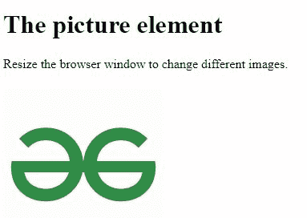
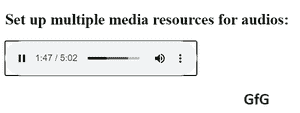

# html 5 中元素如何设置多个媒体资源？

> 原文:[https://www . geesforgeks . org/how-set-multi-media-resources-for-elements-in-html 5/](https://www.geeksforgeeks.org/how-to-set-multiple-media-resources-for-elements-in-html5/)

任务是为媒体元素设置多个媒体资源。我们可以在媒体标签中使用多个源标签。

**语法:**

```html
<media_element>
  <source src="geeksforgeekslogo.resourse_extension">
  <-- Example 1 -->
  <source src="hpnotebook.jpg"> 
  <-- Example 2 -->
  <source src="earth_from_moon.mp4">
</media_element>
```

在上面的语法中，媒体元素可以是图片、视频、音频。根据你的需要使用。

**例 1:**

## 超文本标记语言

```html
<!DOCTYPE html>
<html>

<head>
    <meta name="viewport" 
          content="width=device-width, 
                   initial-scale=1.0">
</head>

<body>

    <h1>The picture element</h1>

    <p>Resize the browser window to change different images.</p>
    <picture>
        <source media="(min-width:650px)" 
                srcset=
"https://media.geeksforgeeks.org/wp-content/uploads/20210324012752/GfG14-300x83.png">
        <source media="(min-width:465px)" 
                srcset=
"https://media.geeksforgeeks.org/wp-content/uploads/20210324012751/GfG13.png">
        
    </picture>

</body>

</html>
```

**输出:**对于<图片>标签内的图像，我们可以使用<源>标签，后面跟有两个属性，分别是—“媒体”和“srcset”。其中媒体属性用于检查浏览器窗口的分辨率，srcset 用于设置图像。



**例 2:** 在音频的情况下使用<音频>标签，并在其中设置多个<源>标签来添加多个音频资源。

## 超文本标记语言

```html
<!DOCTYPE html>
<html>

<head>
    <title>Multiple Audio Resources</title>
</head>

<body>
    <div>
        <h2>Set up multiple media resources for audios:</h2>
        <div>
            <audio controls>
            <source src="GFG.mp3">
            <source src="GFG.wav">
              Sorry!! Your browser doesn't support the
              <code>audio</code> element.    
      </audio>
        </div>
    </div>
</body>

</html>
```

**输出:**这里我们设置了多个资源，正如你在代码库中看到的，但是浏览器已经是最新的了，它正在播放第一个音频示例。如果浏览器不支持它，它会跳到下一个资源并尝试播放。



在 html 5–GfG 中设置多个音频资源

**示例 3:** 对于视频，使用<视频>标签，并在其中设置多个<源>标签，以添加多个视频资源。

## 超文本标记语言

```html
<!DOCTYPE html>
<html>
  <body>
    <p>Adding Video on my webpage</p>

    <p>
      <video width="400" height="350" autoplay>
        <source src="myvid.mp4" type="video/mp4" />
        <source src="myvid.ogg" type="video/ogg" />
      </video>
    </p>
  </body>
</html>
```

**输出:**

<video class="wp-video-shortcode" id="video-581255-1" width="344" height="268" preload="metadata" controls=""><source type="video/mp4" src="https://media.geeksforgeeks.org/wp-content/uploads/output-1.mp4?_=1">[https://media.geeksforgeeks.org/wp-content/uploads/output-1.mp4](https://media.geeksforgeeks.org/wp-content/uploads/output-1.mp4)</video>