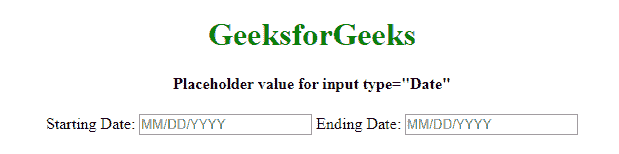
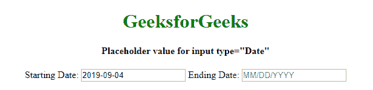
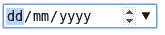
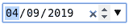
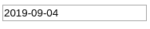

# 如何在 HTML 5 中设置输入类型日期的占位符值？

> 原文:[https://www . geesforgeks . org/如何设置占位符-输入类型值-html 中的日期-5/](https://www.geeksforgeeks.org/how-to-set-placeholder-value-for-input-type-date-in-html-5/)

**占位符属性**不适用于输入类型“日期”，因此在输入类型“日期”中放置任何值作为占位符。您可以在输入字段中使用**。因为您需要为输入类型“日期”设置一个自定义占位符值，并且您有一个下拉日历，用户可以从中选择日期。**

**语法:**

```html
onfocus="(this.type='date')"
```

以下示例说明了上述方法:

**例 1:**

```html
<!DOCTYPE html>
<html>

<head>
    <title>
        Placeholder value for
        input type="Date"
    </title>
</head>

<body style="text-align:center;">

    <h1 style="color:green;">GeeksforGeeks</h1>

    <h4>Placeholder value for input type="Date"</h4>

    <!-- using onfocus="(this.type='date')" -->
    Starting Date:
    <input type="text" placeholder="MM/DD/YYYY"
                    onfocus="(this.type='date')">

    <!-- Not using onfocus="(this.type='date')" -->
    Ending Date:
    <input type="text" placeholder="MM/DD/YYYY">
</body>

</html>                   
```

**输出:**


**注意:**点击左侧字段后，得到 dd/mm/yyyy 框，再次点击后得到日历下拉菜单。这是因为输入框实际上是一个“文本”输入，但是点击它(即聚焦于它)，我们得到数据类型输入。但是右边的字段是普通的文本输入字段。

**示例 2:** 当您失去对日期的关注时，日期字段将变回文本字段。

```html
<!DOCTYPE html>
<html>

<head>
    <title>
        Placeholder value for input type="Date"
    </title>
</head>

<body style="text-align:center;">

    <h1 style="color:green;">GeeksforGeeks</h1>

    <h4>Placeholder value for input type="Date"</h4>

    <!-- using onfocus="(this.type='date')" -->
    Starting Date:
    <input type="text" placeholder="MM/DD/YYYY"
        onfocus="(this.type='date')"
        onblur="(this.type='text')">

    <!-- Not using onfocus="(this.type='date')" -->
    Ending Date:
    <input type="text" placeholder="MM/DD/YYYY">
</body>

</html>  
```

**输出:**


*   如我们所见，我们可以根据需要修改占位符文本。一键进入标准日期输入字段，可以输入日期:
    
*   输入日期后，看起来如下:
    
*   失去焦点后，由于我们介绍的 on bulr 事件，它会变回文本字段:
    

HTML 是网页的基础，通过构建网站和网络应用程序用于网页开发。您可以通过以下 [HTML 教程](https://www.geeksforgeeks.org/html-tutorials/)和 [HTML 示例](https://www.geeksforgeeks.org/html-examples/)从头开始学习 HTML。