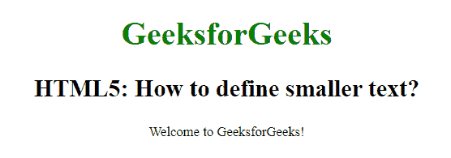

# 如何使用 HTML5 设置较小的文字？

> 原文:[https://www . geesforgeks . org/如何使用-html5 设置更小的文本/](https://www.geeksforgeeks.org/how-to-set-smaller-text-using-html5/)

在本文中，我们将使用文档中的 **[<小>标签](https://www.geeksforgeeks.org/html-small-tag/)** 元素来设置一个较小的文本。HTML 中的这个标签用于设置小字体大小。

**语法:**

```html
<small> Content... </small>
```

**例 1:**

```html
<!DOCTYPE html>
<html>

<head>
    <title>
        How to set smaller 
        text using HTML5 ?
    </title>

    <style>
        body {
            text-align: center;
        }

        h1 {
            color: green;
        }
    </style>
</head>

<body>
    <h1>GeeksforGeeks</h1>

    <h2>
        HTML5: How to define 
        smaller text?
    </h2>

    <small>
        Welcome to GeeksforGeeks!
    </small>
</body>

</html>
```

**输出:**


**支持的浏览器:**

*   谷歌 Chrome
*   微软公司出品的 web 浏览器
*   火狐浏览器
*   歌剧
*   旅行队