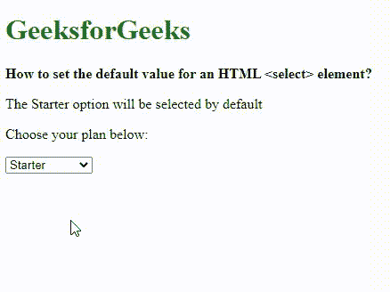
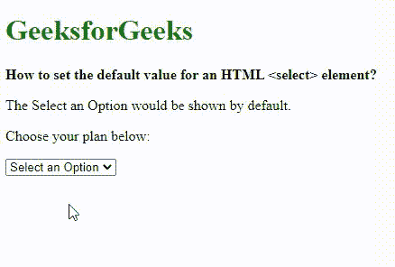

# 如何设置一个 HTML select 元素的默认值？T3】

> 原文:[https://www . geesforgeks . org/如何设置 html 选择元素的默认值/](https://www.geeksforgeeks.org/how-to-set-the-default-value-for-an-html-select-element/)

在本文中，我们将学习如何设置 HTML select 元素的默认值，并通过示例了解它们的实现。

HTML 中的[**选择标签**](https://www.geeksforgeeks.org/html-select-tag/) 用于*创建一个可以选择的选项下拉列表*。[选项标签](https://www.geeksforgeeks.org/html-option-tag/)包含选择时将使用的值。选择元素的默认值可以通过使用所需选项上的**‘selected’**属性来设置。这是一个布尔属性。默认情况下，下拉列表中将显示选择了**属性的选项。我们甚至可以在页面加载后借助 Javascript 设置**选中的**属性。**

****语法:****

```html
<option value="value" selected>Option Name</option>
```

****示例 1:** 该示例通过指定将首先从下拉列表中显示的预选选项来说明所选**属性的使用。****

## **超文本标记语言**

```html
<!DOCTYPE html>
<html>

<head>
    <title>Set the default value for <select> element</title>
</head>

<body>
    <h1 style="color: green">GeeksforGeeks</h1>
    <b>
        How to set the default 
        value for an HTML <select> element?
    </b>
    <p>The Starter option will be selected by default</p>

    <p>Choose your plan below:</p>

    <select name="plan" id="plan">
        <option value="free">Free</option>
        <option value="starter" selected>Starter </option>
        <option value="professional">Professional</option>
        <option value="corporate">Corporate</option>
    </select>
</body>

</html>
```

****输出:****

**

选定的属性** 

****示例 2:** 这也可以用于在列表中添加类似**【选择选项】**的消息。除了选中的属性之外，该选项还有隐藏和禁用属性。**

## **超文本标记语言**

```html
<!DOCTYPE html>
<html>

<head>
    <title>Set the default value for <select> element</title>
</head>

<body>
    <h1 style="color: green">GeeksforGeeks</h1>
    <b>How to set the default value for an 
       HTML <select> element?
    </b>
    <p>The Select an Option would be shown by default.</p>

    <p>Choose your plan below:</p>

    <select name="plan" id="plan">
        <option value="none" selected disabled hidden>Select an Option</option>
        <option value="free">Free</option>
        <option value="starter">Starter </option>
        <option value="professional">Professional</option>
        <option value="corporate">Corporate</option>
    </select>
</body>

</html>
```

****输出:****

**

禁用选定的属性** 

**HTML 是网页的基础，通过构建网站和网络应用程序用于网页开发。您可以通过以下 [HTML 教程](https://www.geeksforgeeks.org/html-tutorials/)和 [HTML 示例](https://www.geeksforgeeks.org/html-examples/)从头开始学习 HTML。**