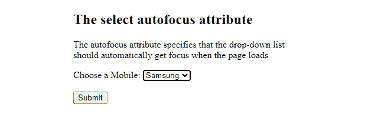

# 在 HTML5 中加载页面时，如何自动设置下拉列表的焦点？

> 原文:[https://www . geesforgeks . org/如何设置页面加载时自动聚焦下拉列表 html5/](https://www.geeksforgeeks.org/how-to-set-the-focus-on-drop-down-list-automatically-when-the-page-loads-in-html5/)

本文的目的是在 HTML5 中加载页面时自动聚焦下拉列表。

**[<选择>自动对焦属性](https://www.geeksforgeeks.org/html-select-autofocus-attribute/)** 是一个*布尔*属性，指定当页面加载时下拉列表应该自动获得焦点。

**语法:**

```html
<select autofocus>
```

**示例:**以下代码演示了带有*自动对焦*的下拉列表。

## 超文本标记语言

```html
<!DOCTYPE html>
<html>
<head>
<title>Autofocus Attribute</title>
</head>
<body>
<h2>The select autofocus attribute</h2>

<p>
  The autofocus attribute specifies that the drop-down list<br>
  should automatically get focus when the page loads:
</p>

<form action="/action_page.php">
  <label for="mobiles">Choose a Mobile:</label>
  <select name="mobiles" id="mobiles" autofocus>
    <option value="samsung">Samsung</option>
    <option value="apple">Apple</option>
    <option value="nokia">Nokia</option>
    <option value="mi">MI</option>
  </select>
  <br><br>
  <input type="submit" value="Submit">
</form>
</body>
</html>
```

**注意:**火狐不支持*选择*标签的*自动对焦*属性。

**输出:**



**支持的浏览器:**

*   铬
*   边缘
*   旅行队
*   歌剧