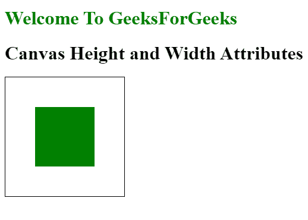

# 如何在 HTML5 中设置画布的高度和宽度？

> 原文:[https://www . geesforgeks . org/如何在 html5 中设置画布的高度和宽度/](https://www.geeksforgeeks.org/how-to-set-the-height-and-width-of-the-canvas-in-html5/)

画布元素是 HTML5 的一部分，它允许我们对 2D 形状和位图图像进行动态的、可脚本化的渲染。借助 HTML5 画布，我们可以制作 2D 游戏、图形、动画和图像合成。画布有两种大小，元素的大小和绘图表面的大小。元素和绘图表面的默认大小都是 300 x 150 屏幕像素。

要设置画布的高度和宽度，HTML5 有两个属性:

*   **身高:**借助身高属性我们可以设置身高。
*   **宽度:**借助 Width 属性我们可以设置宽度。

**语法:**

```html
<canvas id="myCanvas"> HTML Contents... <canvas>
```

**示例:**

## 超文本标记语言

```html
<!DOCTYPE html>
<html>

<body>
    <h1 style="color:green"> Welcome To GeeksForGeeks</h1>
    <h1>Canvas Height and Width Attributes</h1>
    <canvas id="Canvas" width="300" 
            height="300" 
            style="border:3px solid"> 
    </canvas>
    <script>
      var c = document.getElementById("Canvas");
      var ctx = c.getContext("2d");
      ctx.fillStyle = "Green";
      ctx.fillRect(100, 100, 100, 100);
    </script>
</body>

</html>
```

**输出:**



**示例:**使用 CSS 设置高度和宽度

## 超文本标记语言

```html
<!DOCTYPE html>
<html>
<style>
#myCanvas {
    margin: 20px;
    padding: 20px;
    background: #ffffff;
    border: 3px solid green;
    width: 300px;
    height: 190px;
}
</style>

<body>
    <h1 style="color:green"> 
       Welcome To GeeksForGeeks
    </h1>
    <h1>Canvas Height and Width Attributes</h1>
    <canvas id="myCanvas"></canvas>
</body>

</html>
```

**输出:**

