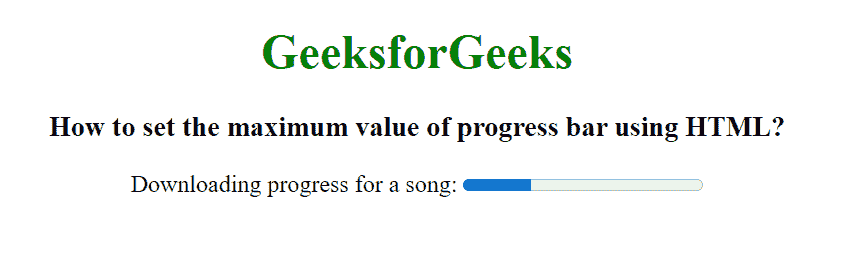

# 如何用 HTML 设置进度条的最大值？

> 原文:[https://www . geeksforgeeks . org/如何使用 html 设置进度条的最大值/](https://www.geeksforgeeks.org/how-to-set-the-maximum-value-of-progress-bar-using-html/)

在本文中，我们通过使用<progress>标签来创建任务的进度条。<progress>标签用于表示任务的进度。它还定义了完成了多少工作，还有多少剩余来下载一个东西。它不用于表示磁盘空间或相关查询。</progress></progress>

进度条的最大值可以通过**最大属性值**来设置。

**语法:**

```html
<progress attributes...> </progress>
```

**属性值:**

*   **级:**返回进度条列表。
*   **max:** 用于设置或返回 max 属性的进度条值。
*   **值:**表示已经完成的工作量。
*   **位置:**返回进度条当前位置。

**示例:**

## 超文本标记语言

```html
<!DOCTYPE html>
<html>

<head>
    <title>
        How to set the maximum value
        of progress bar using HTML?
    </title>
</head>

<body style="text-align: center;">
    <h1 style="color:green;">
        GeeksforGeeks
    </h1>

    <h3>
        How to set the maximum value
        of progress bar using HTML?
    </h3>

    Downloading progress for a song:
    <!-- Set maximum value of progress bar -->
    <progress value="57" max="200">
    </progress>
</body>

</html>
```

**输出:**



**支持的浏览器:**

*   谷歌 Chrome 8.0
*   Internet Explorer 10.0
*   Firefox 16.0
*   Opera 11.0
*   Safari 6.0