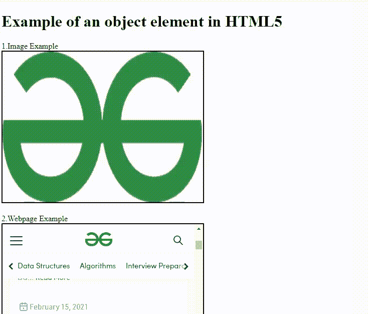

# 如何在 HTML5 中设置对象的名称？

> 原文:[https://www . geesforgeks . org/如何设置 html5 中对象的名称/](https://www.geeksforgeeks.org/how-to-set-the-name-for-the-object-in-html5/)

[<对象>](https://www.geeksforgeeks.org/html-object-tag/)html 5 中的元素用于以任何图像或任何嵌套链接的网页或内容或任何可以做同样工作的插件的形式链接任何外部文件和资源。

**语法:**

```html
<object name="name"></object>
```

**T2 物体/元素的基本用法:**

最初<object>被设计为在其中嵌入不同的应用和浏览器插件，主要用于扩展浏览器的可用性。</object>

**这个元素内可以传递的属性:**

<figure class="table">

| attribute | value | describe |
| --- | --- | --- |
| [data](https://www.geeksforgeeks.org/html-object-data-attribute/) | 统一资源定位器 | It specifies the URL of the data in the object. |
| [Type](https://www.geeksforgeeks.org/html-object-type-attribute/#:~:text=The%20HTML%20type%20Attribute,MIME%20type%20of%20the%20Object.&text=media_type%20It%20is%20used%20to,type%20of%20the%20embedded%20file.) | 媒体类型 | It specifies the media type of the data specified in the data attribute. |
| 类型必须匹配 | 布尔 | Indicates that the resource should be embedded only when the value of the type attribute matches the resource type provided on the data attribute. |
| [Alignment](https://www.geeksforgeeks.org/html-object-align-attribute/#:~:text=HTML%20%7C%20align%20Attribute,-Last%20Updated%20%3A%2030&text=The%20HTML%20align%20Attribute,can%20also%20wrap%20around%20it.) | Up and down | It defines the alignment of objects. |
| [border](https://www.geeksforgeeks.org/html-object-border-attribute/#:~:text=The%20HTML%20border%20attribute,border%20around%20the%20object%20element.&text=Attribute%20Values%3A,border%20in%20terms%20of%20pixel.) r | pixel | It specifies the border around the object. |
| [Height](https://www.geeksforgeeks.org/html-object-height-attribute/#:~:text=The%20HTML%20height%20attribute,element%20in%20terms%20of%20pixel.&text=pixels%3A%20It%20holds%20the%20height,object%20in%20terms%20of%20pixels.) | pixel | It specifies the height of the object. |
| hspace | pixel | It specifies the white space on the left and right sides of the object. |
| vs 步伐 | pixel | It specifies the white space at the top and bottom of the object. |
| [Width](https://www.geeksforgeeks.org/html-object-width-attribute/#:~:text=The%20HTML%20width%20attribute,tag%20in%20terms%20of%20pixels.&text=pixels%3A%20It%20holds%20the%20width,object%20in%20terms%20of%20pixels.) | pixel | It specifies the width of the object. |
| [Name](https://www.geeksforgeeks.org/html-object-name-attribute/) | name | It specifies the name of an object. |
| [Form](https://www.geeksforgeeks.org/html-object-form-attribute/) | 表单 id | It specifies the form id to which the object element belongs. |

</figure>

**示例:**下面是反对链接图像、视频和其他网页的任何 HTML 链接的示例代码:

## 超文本标记语言

```html
<!DOCTYPE html>
<html>

<body>

    <h1>Example of an object element in HTML5</h1>
    <label>1.Image Example</label><br>
    <object data=
"https://media.geeksforgeeks.org/wp-content/uploads/20210214171643/logo.png" 
            width="400" 
            height="300" 
            border="2" 
            name="obj1"></object><br><br>
    <label>2.Webpage Example</label><br>
    <object data="https://www.geeksforgeeks.org/" 
            width="400" 
            height="300" 
            border="2" 
            name="obj2"></object><br><br>
    <label>3.Video Example</label><br>
    <object data=
"https://media.geeksforgeeks.org/wp-content/uploads/20210318163839/v.mp4" 
            width="400" 
            height="300" 
            border="2" 
            name="obj3"></object>

</body>

</html>
```

