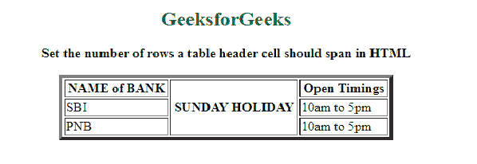
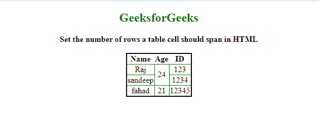

# 如何在 HTML 中设置表格单元格应该跨越的行数？

> 原文:[https://www . geesforgeks . org/如何在 html 中设置表格单元格的行数/](https://www.geeksforgeeks.org/how-to-set-the-number-of-rows-a-table-cell-should-span-in-html/)

在本文中，我们将展示表格标题单元格如何跨越多行。使用 [**< th >**](https://www.geeksforgeeks.org/html-th-tag/) 标记的同时，可以使用 [**rowspan**](https://www.geeksforgeeks.org/html-rowspan-attribute/) 属性完成任务。此属性用于合并一个或多个单元格，以及自动增加单个标题单元格的高度。

**语法:**

```html
<th rowspan = "value">table content...</th>
```

**示例:**

## 超文本标记语言

```html
<!DOCTYPE html>
<html>
  <body>
    <center>
      <h2 style="color: green">GeeksforGeeks</h2>

      <b> 
       Set the number of rows a table header 
       cell should span in HTML 
      </b>
      <table border="4" width="400">
        <tr>
          <th>NAME of BANK</th>
          <th rowspan="3">SUNDAY HOLIDAY</th>
          <th>Open Timings</th>
        </tr>

        <tr>
          <td>SBI</td>
          <td>10am to 5pm</td>
        </tr>

        <tr>
          <td>PNB</td>
          <td>10am to 5pm</td>
        </tr>
      </table>
    </center>
  </body>
</html>
```

**输出:**



行上的标题范围

**例 2:** 在本例中。我们将学习如何使行跨越多个单元格。

使用 [**< td >**](https://www.geeksforgeeks.org/html-td-tag/) 标记内的 [**< tr >**](https://www.geeksforgeeks.org/html-tr-tag/) 标记时，可以使用 [**rowspan**](https://www.geeksforgeeks.org/html-rowspan-attribute/) 属性完成任务。它允许单个表格单元格跨越多个单元格的高度。它包含一个数值，用于定义应该跨越的行数。

**语法:**

```html
<tr>
  <td rowspan = "value">table column content...</td>
</tr>
```

## 超文本标记语言

```html
<!DOCTYPE html>
<html>
  <head>
    <style>
      table {
        border: 2px solid black;
        border-collapse: collapse;
        padding: 6px;
      }
      td {
        border: 1px solid green;
        text-align: center;
      }
    </style>
  </head>

  <body style="text-align: center">
    <center>
      <h2 style="color: green">GeeksforGeeks</h2>
      <b> 
       Set the number of rows a table
       cell should span in HTML 
      </b>

      <br />
      <table>
        <tr>
          <th>Name</th>
          <th>Age</th>
          <th>ID</th>
        </tr>
        <tr>
          <td>Raj</td>
          <!-- This cell will take up space on
                    two rows -->
          <td rowspan="2">24</td>
          <td>123</td>
        </tr>
        <tr>
          <td>sandeep</td>
          <td>1234</td>
        </tr>

        <tr>
          <td>fahad</td>
          <td>21</td>
          <td>12345</td>
        </tr>
      </table>
    </center>
  </body>
</html>

```

**输出:**

