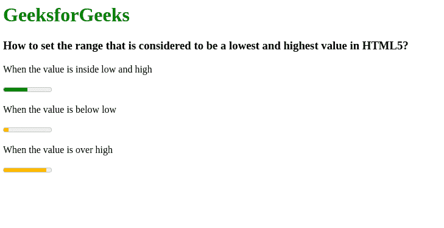

# 如何设置 HTML5 中被认为是最低值和最高值的范围？

> 原文:[https://www . geesforgeks . org/如何设置被认为是 html5 中最低和最高值的范围/](https://www.geeksforgeeks.org/how-to-set-the-range-that-is-considered-to-be-a-lowest-and-highest-value-in-html5/)

在本文中，我们将学习如何设置范围的高低值。这是使用**低**和**高**属性完成的。**高**属性总是小于最大属性值，但大于最小属性和低属性值。同样的，**低**属性总是大于最小属性但小于最大和高属性值。如果数值不在高低范围内，仪表元件将以不同的颜色显示数值。

**语法:**

```html
<meter low="number" high="number">
```

**示例:**

## 超文本标记语言

```html
<!DOCTYPE html>
<html>
  <body>
    <h1 style="color: green">
        GeeksforGeeks
    </h1>
    <h3>
      How to set the range that is 
      considered to be a lowest and 
      highest value
      in HTML5?
    </h3>

    <p>When the value is inside low and high</p>

    <meter value="5" min="0" 
           max="10" low="2" high="8">
    </meter>

    <p>When the value is below low</p>

    <meter value="1" min="0" max="10"
           low="2" high="8">
    </meter>

    <p>When the value is over high</p>

    <meter value="9" min="0" max="10"
           low="2" high="8">
    </meter>
  </body>
</html>
```

**输出:**

