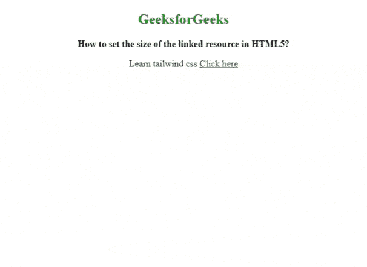
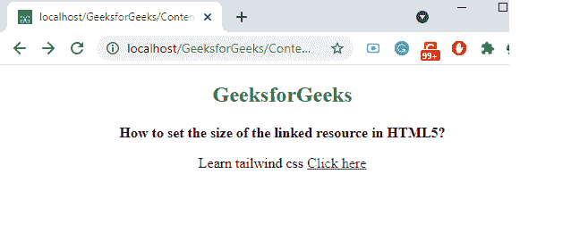

# 如何在 HTML5 中设置链接资源的大小？

> 原文:[https://www . geesforgeks . org/如何在 html5 中设置链接资源的大小/](https://www.geeksforgeeks.org/how-to-set-the-size-of-the-linked-resource-in-html5/)

**方法:**我们通过使用 HTML 中 [**<链接>**](https://www.geeksforgeeks.org/html-link-tag/) 标签中的 [**大小**](https://www.geeksforgeeks.org/html-link-sizes-attribute/) 属性来设置链接资源的大小。用于指定视觉媒体图标的大小，仅在设置为 *rel=“图标*”时有效。它是只读属性。

**语法:**

```html
<link sizes="HeightxWidth | any">
```

设置链接资源大小的可能值如下:

*   **高宽**用于指定链接图标的一个或多个尺寸。高度和宽度的值用“X”或“X”隔开。
*   **任意:**指定图标是可缩放的(像 SVG 或 PNG 图像)。

**例 1:**

## 超文本标记语言

```html
<!DOCTYPE html>
<html>

<head>
    <link id="linkid"
        rel="stylesheet"
        type="text/css"
        href="styles.css"
        sizes="32*32">
</head>

<body style="text-align:center;">
    <h2 style="color:green">GeeksforGeeks</h2>
    <b>How to set the size of the linked resource in HTML5?
    </b><br/>

<p>Learn tailwind css
     <a href=
"https://www.geeksforgeeks.org/css-tailwind-introduction/">
      Click here
     </a>
    </p>

</body>

</html>                
```

**输出:**



**例 2:**

## 超文本标记语言

```html
<!DOCTYPE html>
<html>
  <head>
    <link rel="icon"
          href="geeksimage.png"
          type="image/png"
          sizes="any" />
  </head>

  <body style="text-align: center">
    <h2 style="color: green">GeeksforGeeks</h2>
    <b>How to set the size of the linked resource in HTML5? </b>
    <br />

<p>
      Learn tailwind css
      <a href=
"https://www.geeksforgeeks.org/css-tailwind-introduction/">
        Click here</a>
    </p>

  </body>
</html>
```

**输出:**注意网页左上角的图像图标。

