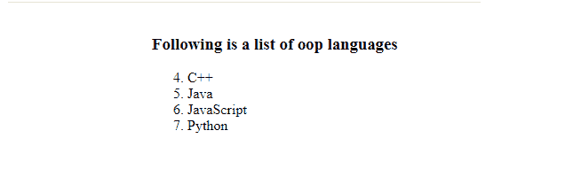
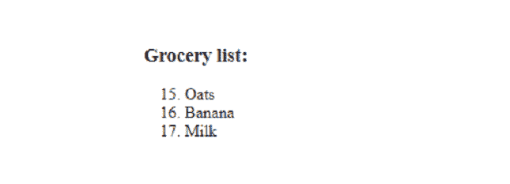

# 如何在 HTML5 中设置有序列表的起始值？

> 原文:[https://www . geesforgeks . org/如何设置 html5 中有序列表的起始值/](https://www.geeksforgeeks.org/how-to-set-the-start-value-of-an-ordered-list-in-html5/)

HTML5 中有序列表的起始值可以通过实现 **[HTML < ol >起始属性](https://www.geeksforgeeks.org/html-ol-start-attribute/)** 并将起始值(数字)作为值传递给属性来指定。

列表的下一个值自动按顺序设置(例如，如果起始值设置为 5，下一个值将是 6，然后是 7，依此类推)。

**语法:**

```html
<ol start="Starting_value"> 
    <li> Content </li> 
</ol>
```

**例 1:** 添加*后开始=“4”*。

## 超文本标记语言

```html
<!DOCTYPE html>
<html>
<head>
<title>Start Example</title>
</head>
<body>
<h3>Following is a list of oop languages</h3>
  <ol start="4">
    <li>C++</li>
    <li>Java</li>
    <li>JavaScript</li>
    <li>Python</li>
  </ol>
</body>
</html>
```

**输出:**



从 4 开始

**例 2:** 在< ol >中增加*start =“15”*后。

## 超文本标记语言

```html
<!DOCTYPE html>
<html>
<head>
<title>Start Example</title>
</head>
<body>
<h3>Grocery list:</h3>
  <ol start="15">
    <li>Oats</li>
    <li>Banana</li>
    <li>Milk</li>
  </ol>
</body>
</html>
```

**输出:**



杂货清单 2