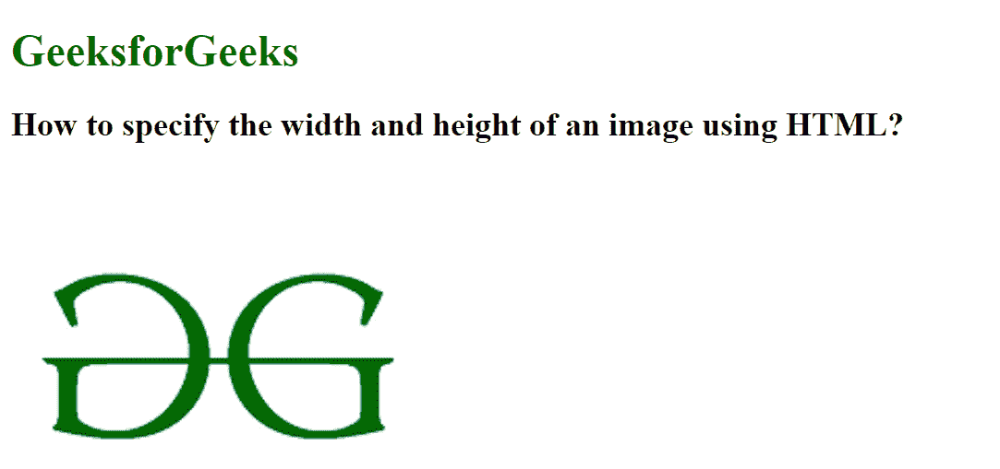
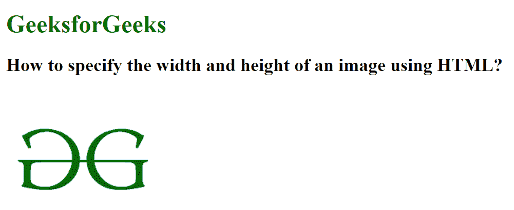

# 如何使用 HTML 设置图像的宽度和高度？

> 原文:[https://www . geesforgeks . org/如何使用 html 设置图像的宽度和高度/](https://www.geeksforgeeks.org/how-to-set-the-width-and-height-of-an-image-using-html/)

可以使用高度和宽度属性设置图像的高度和宽度。高度和宽度可以用像素来设定。

[< img >高度属性](https://www.geeksforgeeks.org/html-img-height-attribute/)用于以像素为单位设置图像的高度。 [< img >宽度属性](https://www.geeksforgeeks.org/html-img-width-attribute/)用于以像素为单位设置图像的宽度。

**示例 1:** 在本例中，我们将设置图像的宽度和高度。

## 超文本标记语言

```html
<!DOCTYPE html> 
<html> 

<head> 
    <title> 
        How to specify the width and 
        height of an image using HTML?
    </title> 
</head> 

<body> 
    <h1 style="color:green;">GeeksforGeeks</h1> 

    <h2>
        How to specify the width and 
        height of an image using HTML?
    </h2> 

     
</body> 

</html>
```

**输出:**



**示例 2:** 在本例中，我们将不分配宽度和高度值，因此图像将以其原始高度和宽度显示。

## 超文本标记语言

```html
<!DOCTYPE html> 
<html> 

<head> 
    <title> 
        How to specify the width and 
        height of an image using HTML?
    </title> 
</head> 

<body> 
    <h1 style="color:green;">GeeksforGeeks</h1> 

    <h2>
        How to specify the width and 
        height of an image using HTML?
    </h2> 

     
</body> 

</html>
```

**输出:**

