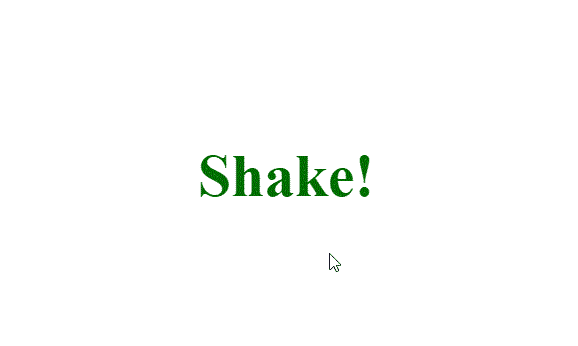

# 如何使用 HTML 和 CSS 在悬停时摇动文本？

> 原文:[https://www . geesforgeks . org/如何使用 html 和 css 在悬停时摇动文本/](https://www.geeksforgeeks.org/how-to-shake-text-on-hover-using-html-and-css/)

摇动文字动画是一个非常酷的动画，可以在网站上使用，这个动画可以很容易地使用一些基本的 HTML 和 CSS 创建，下面一节将指导如何创建动画。

**HTML 代码:**在本节中，我们有一个基本的 **div** 元素，其中包含一些文本。

```html
<!DOCTYPE html>
<html lang="en">
<head>
  <meta charset="UTF-8">
  <meta name="viewport"
        content="width=device-width, initial-scale=1.0">
  <title>Shake Text</title>
</head>
<body>
  <div>
    <h2>Shake!</h2>
  </div>      
</body>
</html>
```

**CSS 代码:**在这一节中我们首先用一些基本的 CSS 来设计文本，并使用**@关键帧**动画，然后使用 **transitionX()** 功能来产生我们悬停在文本上时的晃动效果。

```html
<style>
 *{
    margin: 0;
    padding: 0;
  }
  /* designing the text*/
  div{
    position: absolute;
    top: 50%;
    left: 50%;
    transform: translate(-50%, -50%);
    font-size: 2.5em;
    color: rgb(4, 110, 4);
  }
  /*creating the shake animation*/

  div:hover h2{
    animation:  shake 0.8s  ;
  }

  @keyframes shake{
    0%{
      transform: translateX(0)
    }
    25%{
      transform: translateX(25px);
    }

    50%{
      transform: translateX(-25px);
    }
    100%{
      transform: translateX(0px);
    }
  }

 </style>
```

**最终代码:**是以上两个代码段的组合。

```html
<!DOCTYPE html>
<html lang="en">
<head>
  <meta charset="UTF-8">
  <meta name="viewport"
        content="width=device-width, initial-scale=1.0">
  <title>Shake Text</title>
</head>
<style>
  *{
     margin: 0;
     padding: 0;
   }
   /* designing the text*/
   div{
     position: absolute;
     top: 50%;
     left: 50%;
     transform: translate(-50%, -50%);
     font-size: 2.5em;
     color: rgb(4, 110, 4);
   }
   /*creating the shake animation*/

   div:hover h2{
     animation:  shake 0.8s  ;
   }

   @keyframes shake{
     0%{
       transform: translateX(0)
     }
     25%{
       transform: translateX(25px);
     }

     50%{
       transform: translateX(-25px);
     }
     100%{
       transform: translateX(0px);
     }
   }

  </style>

<body>
  <div>
    <h2>Shake!</h2>
  </div>   

</body>
</html>
```

**输出:**

