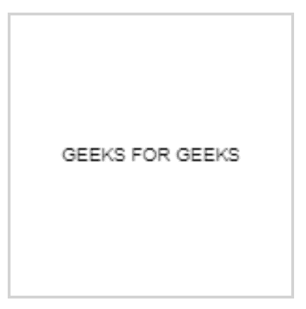
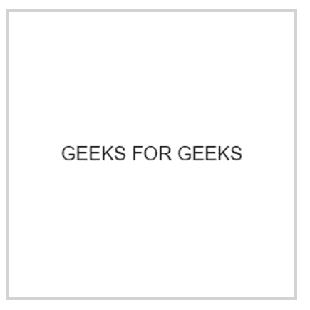

# 如何锐化 HTML5 画布中模糊的文字？

> 原文:[https://www . geesforgeks . org/如何锐化-模糊-html5 中的文本-画布/](https://www.geeksforgeeks.org/how-to-sharpen-blurry-text-in-html5-canvas/)

为了找到这个问题的解决方案，让我们先来了解为什么会出现这个问题。

这个问题的答案是屏幕的像素。模糊的程度通常取决于浏览器或您用来查看画布的设备。不同设备的像素比不同，因此我们会看到模糊的效果。

**问题解决方案:**

我们可以通过使用 [window.devicepixelratio 属性](https://www.geeksforgeeks.org/html-dom-window-devicepixelratio-property/)来解决这个问题

窗口界面的**设备像素比率**返回当前显示设备的物理像素分辨率与 CSS 像素分辨率的比率。这个值也可以解释为像素大小的比率:一个 CSS 像素的大小与一个物理像素的大小之比。

简单来说，这告诉浏览器应该使用多少屏幕的实际像素来绘制单个 CSS 像素。

让我们看一个不使用 devicePixelRatio 的输出的例子:

[](https://media.geeksforgeeks.org/wp-content/uploads/20200803213350/blog13.PNG)

现在让我们编写一些代码来解决这个问题:

```html
<!DOCTYPE html>
<html>

<body>
    <canvas id="canvas" 
            style="border:1px solid #d3d3d3;">
    </canvas>
    <script>
        var canvas = document.getElementById('canvas');
        var ctx = canvas.getContext('2d');
              //window.devicePixelRatio=1; //Blury Text
        window.devicePixelRatio=2;      //Clear Text
        //(CSS pixels).
              //Display Size
        var size = 150;
        canvas.style.width = size + "px";
        canvas.style.height = size + "px";

        var scale = window.devicePixelRatio; 

        canvas.width = Math.floor(size * scale);
        canvas.height = Math.floor(size * scale);

        //CSS pixels for coordinate systems
        ctx.scale(scale, scale);
        ctx.font = '10px Arial';
        ctx.textAlign = 'center';
        ctx.textBaseline = 'middle';

        var x = size / 2;
        var y = size / 2;

        var textString = "GEEKS FOR GEEKS";
        ctx.fillText(textString, x, y);
    </script>

</body>
</html>
```

**输出:**

包含**窗口后，让我们检查代码的输出:**

[](https://media.geeksforgeeks.org/wp-content/uploads/20200803214211/blog23.PNG)

我们在这里假设了两个条件，当我们保持**window . devicepixel ratio**= 1 时，我们可以看到模糊的效果，但是当我们保持该值为 2 时，我们可以看到我们得到了清晰的文本。这是因为 **1** 的值表示经典的 **96 DPI(在某些平台上为 76 DPI)**显示器，而 **2** 的值预计用于 **HiDPI/Retina 显示器。**