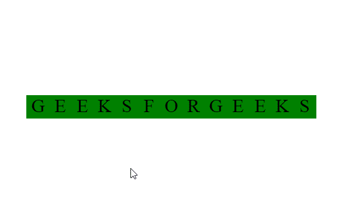

# 如何使用 HTML 和 CSS 在悬停时扭曲文本？

> 原文:[https://www . geeksforgeeks . org/如何使用 html 和 css 扭曲悬停文本/](https://www.geeksforgeeks.org/how-to-skew-text-on-hover-using-html-and-css/)

歪斜文字动画效果可以使用 **[HTML](https://www.geeksforgeeks.org/html-tutorials/)** 和 **[CSS](https://www.geeksforgeeks.org/css-tutorials/)** 来创建，这个动画看起来很酷，可以用在网站上让它们看起来更有活力，下面几节将指导如何创建想要的动画效果。

**第一部分:**在这一部分中，我们将创建一个基本的 **div** 标签，该标签由内部的各种 **span** 标签组成。

## 超文本标记语言

```html
<!DOCTYPE html>
<html lang="en">
<head>
  <meta charset="UTF-8">
  <meta name="viewport" 
        content="width=device-width, initial-scale=1.0">
  <title>Skew Text</title>
</head>
<body>
  <div>
    <span>G</span>
    <span>E</span>
    <span>E</span>
    <span>K</span>
    <span>S</span>
    <span>F</span>
    <span>O</span>
    <span>R</span>
    <span>G</span>
    <span>E</span>
    <span>E</span>
    <span>K</span>
    <span>S</span>

  </div>
</body>
</html>
```

**第二部分:**在本部分中，我们将首先使用基本的 CSS 属性设计 **span** 标签。此外，我们将使用**第 n 个子元素()**选择器选择元素的子元素，并使用**skyy()**属性在悬停时产生所需的效果。

**CSS 代码:**

## 半铸钢ˌ钢性铸铁(Cast Semi-Steel)

```html
<style>
  *{
    margin: 0;
    padding: 0;
   }

   div{
     position: absolute;
     top: 50%;
     left: 50%;
     transform: translate(-50%, -50%);
     display: flex;
     align-items: center;
   }
   span{
     height: 40px;
     width: 40px;
     margin-right: -2px;
     background-color: green;
     text-align: center;
     font-size: 2em;
   }
   div:hover span:nth-child(odd){
     transform: skewY(-15deg);
   }
   div:hover span:nth-child(even){
     transform: skewY(15deg);
   }  

 </style>
```

**最终代码:**是以上两个代码段的组合

## 超文本标记语言

```html
<!DOCTYPE html>
<html lang="en">
<head>
  <meta charset="UTF-8">
  <meta name="viewport" 
        content="width=device-width, initial-scale=1.0">
  <title>Skew Text</title>
</head>
<style>
  *{
    margin: 0;
    padding: 0;
   }

   div{
     position: absolute;
     top: 50%;
     left: 50%;
     transform: translate(-50%, -50%);
     display: flex;
     align-items: center;
   }
   span{
     height: 40px;
     width: 40px;
     margin-right: -2px;
     background-color: green;
     text-align: center;
     font-size: 2em;
   }
   div:hover span:nth-child(odd){
     transform: skewY(-15deg);
   }
   div:hover span:nth-child(even){
     transform: skewY(15deg);
   }  

 </style>

<body>
  <div>
    <span>G</span>
    <span>E</span>
    <span>E</span>
    <span>K</span>
    <span>S</span>
    <span>F</span>
    <span>O</span>
    <span>R</span>
    <span>G</span>
    <span>E</span>
    <span>E</span>
    <span>K</span>
    <span>S</span>

  </div>
</body>
</html>
```

**输出:**

