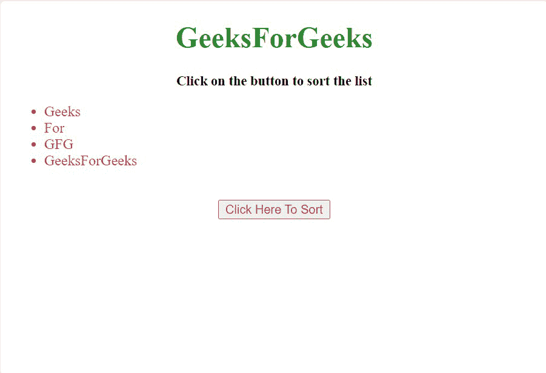
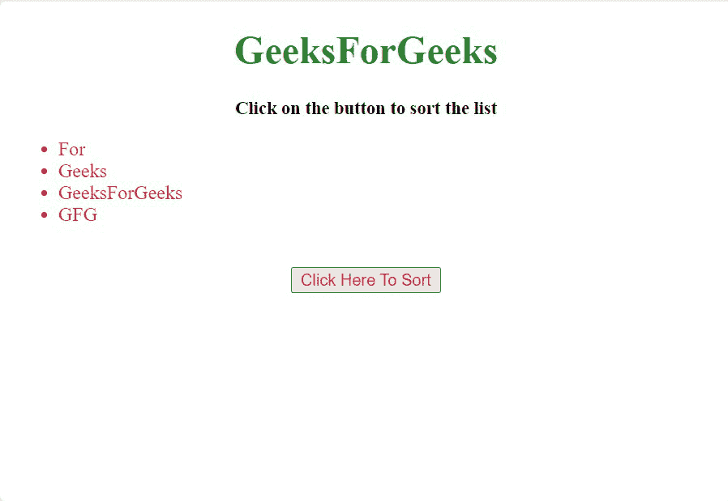

# 如何使用 JavaScript 对 HTML 列表进行排序？

> 原文:[https://www . geesforgeks . org/如何使用 javascript 对 html 列表进行排序/](https://www.geeksforgeeks.org/how-to-sort-an-html-list-using-javascript/)

给定一个元素列表，任务是按照字母顺序对它们进行排序，并在 JavaScript 的帮助下将每个元素放入列表中。

**insertBefore()方法:**HTML DOM 中的 insertBefore()方法用于在用户指定的现有节点之前插入一个新节点。

**语法:**

```html
node.insertBefore( newnode, existingnode )
```

**参数:**该方法接受两个参数，如上所述，如下所述:

*   **newnode:** 为必选参数。此参数包含需要插入的新节点对象。
*   **existingnode:** 必选参数。它描述了新节点在此节点之前插入的位置。如果设置为空，则 insertBefore 方法将在末尾插入新节点。

**示例:**在本例中，选择列表元素，然后将其传递给函数进行排序。排序后，使用 insertBefore()方法以排序的方式将它们追加到父元素。

## 超文本标记语言

```html
<!DOCTYPE html>
<html>

<head>
    <title>
        Sort a list alphabetically Using JavaScript
    </title>

    <script>
        function sort() {

            // Declaring Variables
            var geek_list, i, run, li, stop;

            // Taking content of list as input
            geek_list = document.getElementById("GeekList");

            run = true;

            while (run) {
                run = false;
                li = geek_list.getElementsByTagName("LI");

                // Loop traversing through all the list items
                for (i = 0; i < (li.length - 1); i++) {
                    stop = false;
                    if (li[i].innerHTML.toLowerCase() > 
                        li[i + 1].innerHTML.toLowerCase()) {
                        stop = true;
                        break;
                    }
                }

                /* If the current item is smaller than 
                   the next item then adding it after 
                   it using insertBefore() method */
                if (stop) {
                    li[i].parentNode.insertBefore(
                            li[i + 1], li[i]);

                    run = true;
                }
            }
        }
    </script>
</head>

<body>
    <h1 style="text-align:center;
        color: forestgreen;">
        GeeksForGeeks
    </h1>
    <p style="text-align:center; font-size: 15px;
        font-weight: bold;">
        Click on the button to sort the list
    </p>

    <ul style="color: crimson;" id="GeekList">
        <li>Geeks</li>
        <li>For</li>
        <li>GFG</li>
        <li>GeeksForGeeks</li>
    </ul>
    <br>

    <center>
        <button style="color: crimson;"
            onclick="sort()">
            Click Here To Sort
        </button>
    </center>
</body>

</html>
```

**输出:**

*   **点击按钮前:** 
*   **点击按钮后:** 