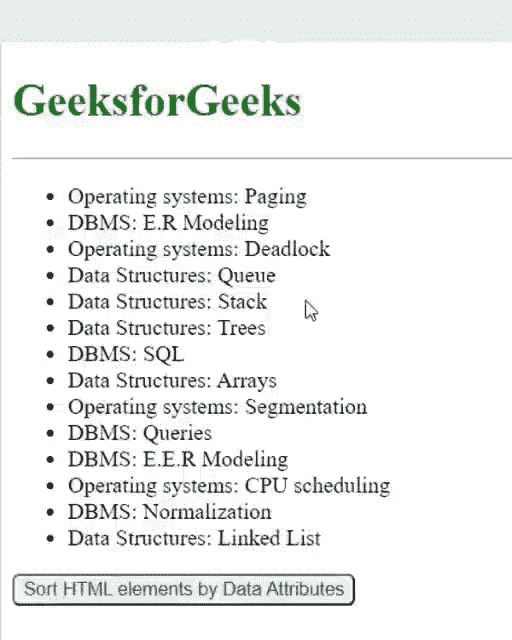
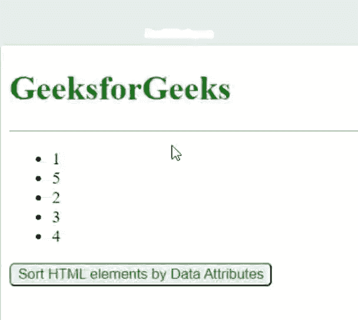

# 如何按照数据属性对 HTML 元素进行排序？

> 原文:[https://www . geesforgeks . org/如何按数据属性对 html 元素进行排序/](https://www.geeksforgeeks.org/how-to-sort-html-elements-by-data-attribute/)

在本文中，让我们看看如何使用数据属性对 HTML 元素进行排序。

我们可以使用数据属性对列表等 HTML 元素进行排序。数据属性由前缀和后缀两部分组成，前缀数据是必需的，后缀数据可以是与元素中的数据相关的任何自定义名称，并且它应该至少有一个小写字符。数据集属性可以访问数据。

**语法:**

```html
data-anysuffix 
```

在本文中，我们使用带有变量值的数据属性对无序列表元素进行排序，这些元素将被排序。

**例 1:** 以主题为数据属性，对主题及其主题进行排序和分组。

## 超文本标记语言

```html
<!DOCTYPE html>
<html lang="en">

<head>
    <!--Meta data-->
    <meta charset="UTF-8">
    <meta http-equiv="X-UA-Compatible" content="IE=edge">
    <meta name="viewport" content="width=device-width,
         initial-scale=1.0">

    <style>
        h1 {
            color: green;
        }

        button {
            color: green;
            border-radius: 5px;
        }
    </style>
</head>

<!-- Whatever content in body tag 
    appears on the webpage-->
<body>
    <h1>GeeksforGeeks</h1>
    <hr>

    <ul id="list">
        <li class="subject" data-subject="Operating systems">
            Operating systems: Paging
        </li>
        <li class="subject" data-subject="DBMS">
            DBMS: E.R Modeling
        </li>
        <li class="subject" data-subject="Operating systems">
            Operating systems: Deadlock
        </li>
        <li class="subject" data-subject="Data Structures">
            Data Structures: Queue
        </li>
        <li class="subject" data-subject="Data Structures">
            Data Structures: Stack
        </li>
        <li class="subject" data-subject="Data Structures">
            Data Structures: Trees
        </li>
        <li class="subject" data-subject="DBMS">DBMS: SQL</li>
        <li class="subject" data-subject="Data Structures">
            Data Structures: Arrays
        </li>
        <li class="subject" data-subject="Operating systems">
            Operating systems: Segmentation
        </li>
        <li class="subject" data-subject="DBMS">
            DBMS: Queries
        </li>
        <li class="subject" data-subject="DBMS">
            DBMS: E.E.R Modeling
        </li>
        <li class="subject" data-subject="Operating systems">
            Operating systems: CPU scheduling
        </li>
        <li class="subject" data-subject="DBMS">
            DBMS: Normalization
        </li>
        <li class="subject" data-subject="Data Structures">
            Data Structures: Linked List
        </li>
    </ul>

    <!-- onclick event to sort data-->
    <button onclick="SortData()">
        Sort HTML elements by Data Attributes
    </button>

    <script>
        function comparator(a, b) {
            if (a.dataset.subject < b.dataset.subject)
                return -1;
            if (a.dataset.subject > b.dataset.subject)
                return 1;
            return 0;
        }

        // Function to sort Data
        function SortData() {
            var subjects =
                document.querySelectorAll("[data-subject]");
            var subjectsArray = Array.from(subjects);
            let sorted = subjectsArray.sort(comparator);
            sorted.forEach(e =>
                document.querySelector("#list").
                    appendChild(e));
        }
    </script>
</body>

</html>
```

**输出:**点击按钮后，数据根据 HTML 元素的数据属性进行排序，重新排列的列表出现在输出中。



**示例 2:** 根据列表的数据属性对整数进行排序:

## 超文本标记语言

```html
<!DOCTYPE html>
<html lang="en">

<head>
    <!--Meta data-->
    <meta charset="UTF-8">
    <meta http-equiv="X-UA-Compatible" content="IE=edge">
    <meta name="viewport" content="width=device-width,
         initial-scale=1.0">

    <style>
        h1 {
            color: green;
        }

        button {
            color: green;
            border-radius: 5px;
        }
    </style>
</head>

<!-- Whatever content in body tag 
    appears on the webpage-->
<body>
    <h1>GeeksforGeeks</h1>
    <hr>

    <ul id="list">
        <li class="index" data-index="1">1 </li>
        <li class="index" data-index="5">5</li>
        <li class="index" data-index="2">2</li>
        <li class="index" data-index="3">3</li>
        <li class="index" data-index="4">4 </li>
    </ul>

    <!-- onclick event to sort data-->
    <button onclick="SortData()">
        Sort HTML elements by Data Attributes
    </button>

    <script>
        function comparator(a, b) {
            if (a.dataset.index < b.dataset.index)
                return -1;
            if (a.dataset.index > b.dataset.index)
                return 1;
            return 0;
        }

        // Function to sort Data
        function SortData() {
            var indexes = document.querySelectorAll("[data-index]");
            var indexesArray = Array.from(indexes);
            let sorted = indexesArray.sort(comparator);
            sorted.forEach(e =>
                document.querySelector("#list").appendChild(e));
        }
    </script>
</body>

</html>
```

**输出:**

