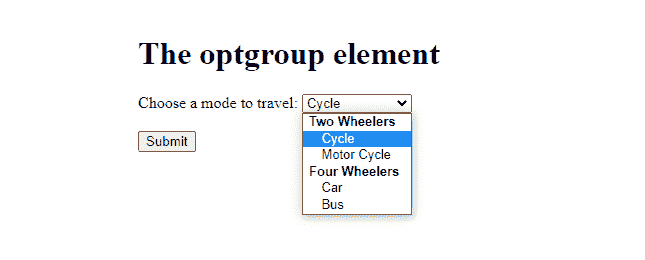
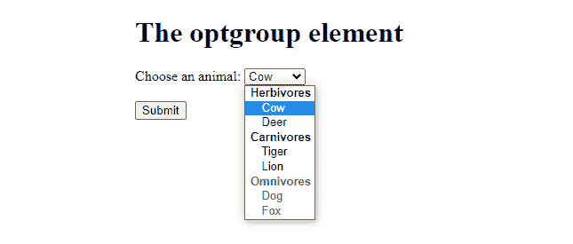

# 如何在 HTML5 中为 optgroup 标签指定标签？

> 原文:[https://www . geesforgeks . org/how-to-specify-a-label-for-opt group-tag-in-html 5/](https://www.geeksforgeeks.org/how-to-specify-a-label-for-an-optgroup-tag-in-html5/)

HTML****<opt group>**元素在**<选择>** 元素内创建选项分组。**

****[HTML <选项组>标签属性](https://www.geeksforgeeks.org/html-optgroup-label-attribute/)** 文本用于指定选项组的标签。**禁用**属性用于指定应禁用选项组。**

****语法:****

```html
<optgroup label="name">
```

****示例 1:****后面的示例演示了 HTML5 **中的简单 optgroup 标记。******

## ****超文本标记语言****

```html
**<!DOCTYPE html>
<html>
<body>

<h1>The optgroup element</h1>

<form action="">
  <label for="travel">Choose a mode to travel:</label>
  <select name="travel" id="travel">
    <optgroup label="Two Wheelers">
      <option value="cycle">Cycle</option>
      <option value="motor_cycle">Motor Cycle</option>
    </optgroup>
    <optgroup label="Four Wheelers">
      <option value="car">Car</option>
      <option value="bus">Bus</option>
    </optgroup>
  </select>
  <br><br>
  <input type="submit" value="Submit">
</form>

</body>
</html>**
```

******输出:******

********

******示例 2:** 以下示例演示了具有禁用属性的 optgroup 标记。****

## ****超文本标记语言****

```html
**<!DOCTYPE html>
<html>
<body>

<h1>The optgroup element</h1>
<form action="/action_page.php">
  <label for="food_chain">Choose an animal:</label>
  <select name="food_chain" id="food_chain">
    <optgroup label="Herbivores">
      <option value="cow">Cow</option>
      <option value="deer">Deer</option>
    </optgroup>
    <optgroup label="Carnivores">
      <option value="tiger">Tiger</option>
      <option value="lion">Lion</option>
    </optgroup>
    <optgroup label="Omnivores" disabled>
      <option value="dog">Dog</option>
      <option value="fox">Fox</option>
    </optgroup>
  </select>
  <br><br>
  <input type="submit" value="Submit">
</form>

</body>
</html>**
```

******输出:******

****

具有禁用属性的 optgroup 标记****