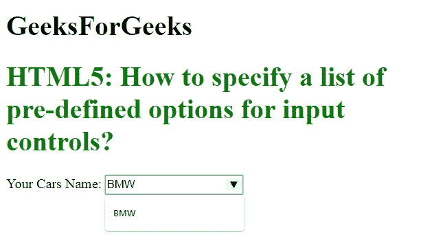
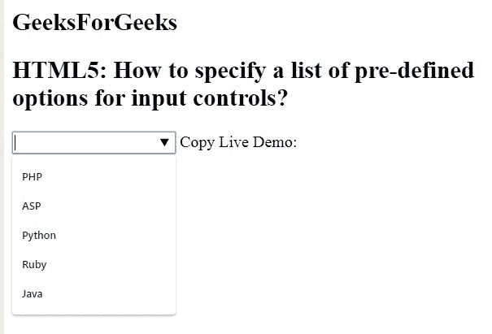

# 如何在 HTML5 中指定输入控件的预定义选项列表？

> 原文:[https://www . geesforgeks . org/如何指定 html5 中输入控件的预定义选项列表/](https://www.geeksforgeeks.org/how-to-specify-a-list-of-pre-defined-options-for-input-controls-in-html5/)

在本文中，我们使用 HTML 列表属性为输入控件指定了一个预定义选项列表。

**语法:**

```html
<input list="datalist_id"/>
```

**例 1:**

```html
<!DOCTYPE html> 
<html> 

<head> 
    <title>
How to specify a list of pre-defined options for input controls? 
</title> 
</head> 

<body> 
    <h1> 
        GeeksForGeeks 
    </h1> 
    <h1 style="color:green"> 
How to specify a list of pre-defined options for input controls?

</h1> 

    <form action=""> 
        <label>Your Cars Name: </label> 
        <input list="cars"> 
        <datalist id="cars"> 
            <option value="BMW" /> 
            <option value="Bentley" /> 
            <option value="Mercedes" /> 
            <option value="Audi" /> 
            <option value="Volkswagen" /> 
        </datalist> 
    </form> 
</body> 

</html> 
```

**输出:**


**例 2:**

```html
<!doctype html>  
<html>  
<head>  
<title>
How to specify a list of pre-defined options for input controls?
</title>  
</head>  
<body>
     <h2>
         GeeksForGeeks
     </h2>
    <h2>
How to specify a list of pre-defined options for input controls?

    </h2>  
<input list="Languages" />   
<datalist id="Languages">  
<option value="PHP">  
<option value="ASP">  
<option value="Python">  
<option value="Ruby">  
<option value="Java">  
</datalist>  
</body>  
</html>  
```

**输出:**
