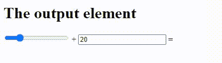

# 如何在 HTML 中为输出元素指定名称？

> 原文:[https://www . geesforgeks . org/如何为 html 中的输出元素指定名称/](https://www.geeksforgeeks.org/how-to-specify-a-name-for-the-output-element-in-html/)

**名称**属性指定一个 **<输出>** 元素的名称。它用于在表单数据提交后引用表单数据，或者在 JavaScript 中引用元素。 **<输出>** 标记用于表示计算结果。

使用> 类型属性的 HTML strong <，因为它指定了计算结果和计算中使用的元素之间的关系。**表单**被使用是因为它指定了它属于哪个表单的输出元素。**之所以使用名称**，是因为它指定了输出元素的名称。

**语法:**

```html
<output name="name">
```

**示例:**

## 超文本标记语言

```html
<!DOCTYPE html>
<html>
    <body>

        <h1>The output element</h1>

        <form oninput="k.value=parseInt(x.value)+parseInt(y.value)">
          <input type="range" id="x" value="20"> + 
          <input type="number" id="y" value="20">
          = <output name="k" for="x y"></output>
        </form>
    </body>
</html>
```

**输出:**

