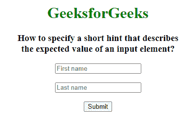

# 如何用 HTML 指定描述输入元素期望值的简短提示？

> 原文:[https://www . geesforgeks . org/如何使用 html 指定描述输入元素预期值的简短提示/](https://www.geeksforgeeks.org/how-to-specify-a-short-hint-that-describes-the-expected-value-of-an-input-element-using-html/)

占位符属性为输入字段指定一个简短提示，描述输入字段/文本区域的预期值。在用户输入值之前，短提示会显示在字段中。

**语法:**

```html
<element palceholder="value">
```

**属性值:**该属性描述输入字段中的简短提示。

**示例:**

## 超文本标记语言

```html
<!DOCTYPE html>
<html>

<head>
    <title>
        How to specify a short hint
        that describes the expected
        value of an input element?
    </title>
</head>

<body style="text-align: center;">
    <h1 style="color: green;">
        GeeksforGeeks
    </h1>

    <h3>
        How to specify a short hint that
        describes <br>the expected
        value of an input element?
    </h3>

    <form action=" ">
        <input type="text" name="fname" 
            placeholder="First name">
        <br><br>

        <input type="text" name="lname" 
            placeholder="Last name">
        <br><br>

        <input type="submit" value="Submit">
    </form>
</body>

</html>
```

**输出:**



**支持的浏览器:**占位符属性支持的浏览器如下:

*   谷歌 Chrome
*   微软公司出品的 web 浏览器
*   火狐浏览器
*   歌剧
*   旅行队