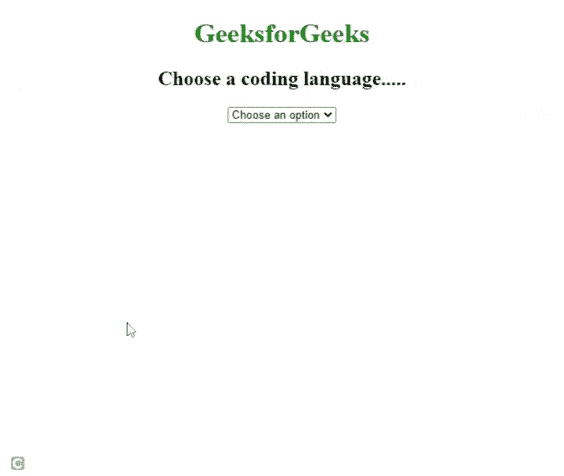

# 如何在 HTML5 中为一个选项指定一个较短的标签？

> 原文:[https://www . geeksforgeeks . org/如何为 html5 中的选项指定较短的标签/](https://www.geeksforgeeks.org/how-to-specify-a-shorter-label-for-an-option-in-html5/)

HTML 选项 [*标签*](https://www.geeksforgeeks.org/html-label-tag/) 属性指定定义选项短标签的文本值。

在下拉列表中，将显示较短的版本。存储在 [<中的对象选择>](https://www.geeksforgeeks.org/html-select-tag/) 、 [<选项组>](https://www.geeksforgeeks.org/html-optgroup-tag/) 或 [<数据列表>](https://www.geeksforgeeks.org/html-datalist-tag/) 元素由 HTML [*<选项>*](https://www.geeksforgeeks.org/html-option-tag/) 元素定义。因此， *<选项>* 可以用来表示 HTML 文档中的弹出菜单项和其他项目列表。

**语法:**

```html
<option label="text">
```

**示例:**一个*选项*元素的*标签*属性如下例所示。

## 超文本标记语言

```html
<!DOCTYPE html>
<html>
<head>

<style>
    body
      {
        text-align:center;
      } 
    </style>

</head>

<body>
    <h1 style="color:green">GeeksforGeeks</h1>

    <h2>
     Choose a Coding Language in which you code....
   </h2>

    <select>
        <option>Choose an option</option>
        <option label="C">C Programming</option>
        <option label="C++">C++ Programming</option>
        <option label="JAVA">JAVA Programming</option>
        <option label="Python">Python Programming</option>
        <option label="C#">C# Programming</option>
    </select>
</body>

</html>
```

**输出:**



标签 1

**例 2:**

## 超文本标记语言

```html
<!DOCTYPE html>
<html>
<head>

  <style>
    body
      {
        text-align:center;
      }
    h1
      {      
        color:green;
      }

    h2
      {      
        color:orange;
      }
  </style>

</head>

<body>
    <h1>GeeksforGeeks</h1>

    <h2>
     Choose a Course in which you want to enroll
    </h2>

    <select>
        <option>Choose an option</option>
        <option label="Java Collections">1</option>
        <option label="DSA Self Paced">2</option>
        <option label="Live Backend Development in Java">3</option>
        <option label="Python Library">4</option>
        <option label="Standard Template Library in C+">5</option>
    </select>
</body>

</html>
```

**输出:**


标签 2

**注意:**火狐不支持<选项>标签属性。