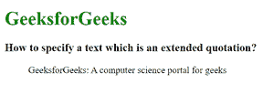

# 如何在 HTML 中指定一个是扩展引号的文本？

> 原文:[https://www . geeksforgeeks . org/如何指定一个 html 中的扩展报价文本/](https://www.geeksforgeeks.org/how-to-specify-a-text-which-is-an-extended-quotation-in-html/)

HTML 中的 **< blockquote >标签**用于显示长引语(引用自其他来源的部分)。它会改变对齐方式，使其与众不同。它包含开始和结束标签。

**语法:**

```html
<blockquote> Contents... </blockquote>

```

**例 1:**

## 超文本标记语言

```html
<!DOCTYPE html>
<html>

<head>
    <title>
        How to specify a text which 
        is an extended quotation?
    </title>
</head>

<body>
    <h1 style="color:green;">
        GeeksforGeeks
    </h1>

    <h3>
        How to specify a text which 
        is an extended quotation?
    </h3>

    <blockquote>
        GeeksforGeeks: A computer 
        science portal for geeks
    </blockquote>
</body>

</html>
```

**输出:**



**例 2:** 在本例中，我们将添加 cite 属性。cite 属性保存指定报价来源的 URL。

## 超文本标记语言

```html
<!DOCTYPE html>
<html>

<head>
    <title>
        How to specify a text which
        is an extended quotation?
    </title>
</head>

<body>
    <h1 style="color:green;">
        GeeksforGeeks
    </h1>

    <h3>
        How to specify a text which
        is an extended quotation?
    </h3>

    <blockquote cite = "www.geeksforgeeks.org">
        GeeksforGeeks: A computer
        science portal for geeks
    </blockquote>
</body>

</html>
```

**输出:**

