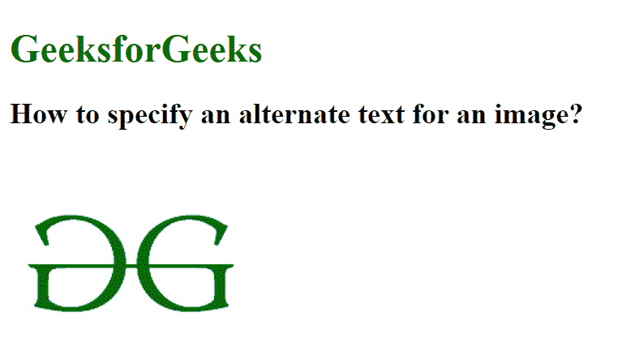
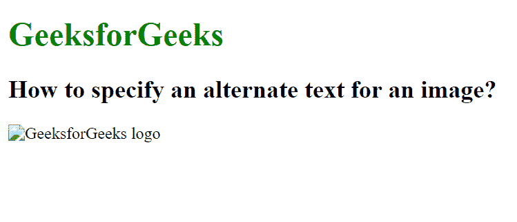

# 如何在 HTML 中为图像指定替代文本？

> 原文:[https://www . geesforgeks . org/如何指定 html 中图像的替代文本/](https://www.geeksforgeeks.org/how-to-specify-an-alternate-text-for-an-image-in-html/)

当图像未显示/加载时，图像的替代文本非常有用。如果图像未被加载，则它的替代文本会显示在网页上。替代文本是图像的替代信息。

**示例 1:** 在本例中，图像路径包含图像，因此它将显示图像。

## 超文本标记语言

```html
<!DOCTYPE html> 
<html> 

<head> 
    <title> 
        How to specify an alternate 
        text for an image? 
    </title> 
</head> 

<body> 
    <h1 style="color:green;">GeeksforGeeks</h1> 

    <h2>
        How to specify an alternate 
        text for an image?
    </h2> 

     
</body> 

</html>
```

**输出:**



**示例 2:** 在此示例中，图像路径不正确，因此将显示替代文本信息。

## 超文本标记语言

```html
<!DOCTYPE html> 
<html> 

<head> 
    <title> 
        How to specify an alternate 
        text for an image? 
    </title> 
</head> 

<body> 
    <h1 style="color:green;">GeeksforGeeks</h1> 

    <h2>
        How to specify an alternate 
        text for an image?
    </h2> 

     
</body> 

</html>
```

**输出:**

