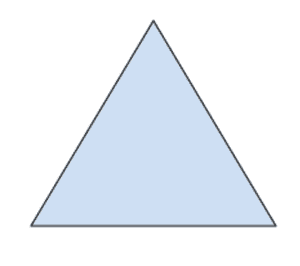

# 如何在 HTML 中将一个图像指定为服务器端图像映射？

> 原文:[https://www . geesforgeks . org/如何指定图像为服务器端图像-html 中的地图/](https://www.geeksforgeeks.org/how-to-specify-an-image-as-a-server-side-image-map-in-html/)

在图像映射中，用图像内的某组坐标来指定图像，这些坐标充当到不同目的地的超链接区域。它不同于图像链接，因为在图像链接中，图像可以用于服务单个链接或目的地，而在映射图像中，图像的不同坐标可以服务不同的链接或目的地。

<map>元素用于定义用户界面上可点击的地图图像。<map>需要标签来帮助图像和地图之间的关系。<map>元素包含多个元素，用于定义图像地图中的可点击区域。</map></map></map>

**示例:**

## 超文本标记语言

```html
<!DOCTYPE html>
<html>

<head>
    <title>
        How to Specify an image as
        a server-side image-map?
    </title>
</head>

<body style="text-align:center;">
    <h1 style="color:green;">
        GeeksforGeeks
    </h1>

    <h2>
        How to Specify an image as
        a server-side image-map?
    </h2>

    

    <map name="shapemap">
        <!-- area tag contained image. -->
        <area shape="poly"
            coords="59,31,28,83,91,83"
href="https://media.geeksforgeeks.org/wp-content/uploads/20190227165802/area2.png"
            alt="Triangle">

        <area shape="circle"
            coords="155,56,26"
href="https://media.geeksforgeeks.org/wp-content/uploads/20190227165934/area3.png"
            alt="Circle">

        <area shape="rect"
            coords="224,30,276,82"
href="https://media.geeksforgeeks.org/wp-content/uploads/20190227170021/area4.png"
            alt="Square">
    </map>
</body>

</html>
```

**输出:**

**点击具体可点击区域前:**


**点击具体可点击区域后:**

