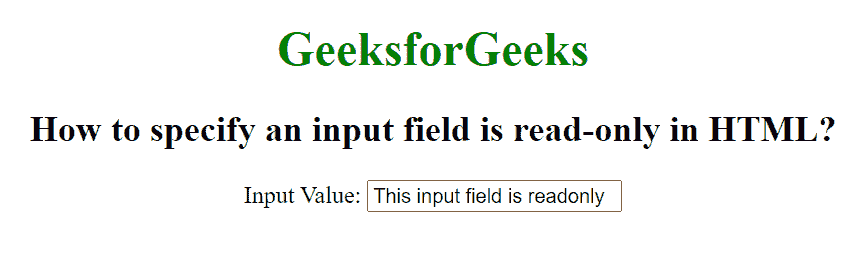

# 如何在 HTML 中指定一个输入字段是只读的？

> 原文:[https://www . geesforgeks . org/如何在 html 中指定输入字段为只读/](https://www.geeksforgeeks.org/how-to-specify-an-input-field-is-read-only-in-html/)

在本文中，我们将在 HTML 中指定一个只读的输入字段。<input>元素的只读属性用于指定输入字段是只读的。如果一个输入是只读的，那么它的内容不能改变，但可以复制和突出显示。它是一个布尔属性。

**语法:**

```html
<input readonly>
```

**示例:**本示例使用<输入>只读属性来设置只读值。

## 超文本标记语言

```html
<!DOCTYPE html>
<html>

<head>
    <title>
        How to specify an input
        field is read-only in HTML?
    </title>
</head>

<body style="text-align:center">
    <h1 style="color: green;">
        GeeksforGeeks
    </h1>

    <h2>
        How to specify an input
        field is read-only in HTML?
    </h2>

    <label>Input Value:

        <!--A readonly input-->
        <input type="text" name="value" 
            value="This input field is readonly"
            readonly>
    </label>
</body>

</html>
```

**输出:**

