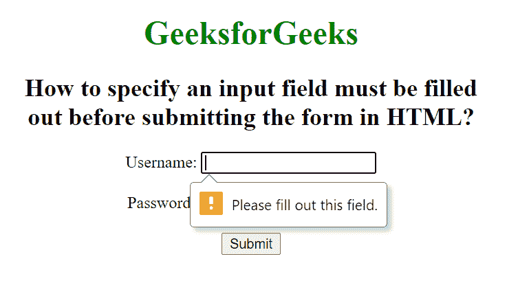

# 如何指定在 HTML 提交表单前必须填写的输入字段？

> 原文:[https://www . geesforgeks . org/如何在提交 html 表单之前指定必须填写的输入字段/](https://www.geeksforgeeks.org/how-to-specify-an-input-field-must-be-filled-out-before-submitting-the-form-in-html/)

在本文中，我们将指定在提交表单之前必须填写的输入字段。“需要 HTML”属性是一个布尔属性，用于指定在提交表单之前必须填写输入元素。该属性适用于其他类型的输入，如单选、复选框、数字、文本等。

**语法:**

```html
<input required>
```

**示例:**该示例说明了在输入字段中使用必需属性。

## 超文本标记语言

```html
<!DOCTYPE html>
<html>

<head>
    <title>
        How to specify an input field
        must be filled out before
        submitting the form in HTML?
    </title>

    <style>
        h1 {
            color: green;
        }

        body {
            text-align: center;
        }
    </style>
</head>

<body>
    <h1>GeeksforGeeks</h1>
    <h2>
        How to specify an input field
        must be filled <br>out before
        submitting the form in HTML?
    </h2>
    <form action="">
        Username:
        <input type="text" name="usrname" required>
        <br><br>

        Password:
        <input type="password" 
            name="password" required>
        <br><br>

        <input type="submit">
    </form>
</body>

</html>
```

**输出:**

