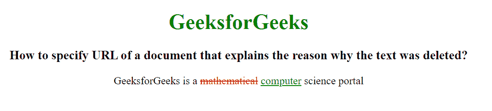

# 如何指定一个文档的 URL，说明在 HTML 中删除文本的原因？

> 原文:[https://www . geesforgeks . org/如何指定一个 url 到一个文档，该文档解释了该文本在 html 中被删除的原因/](https://www.geeksforgeeks.org/how-to-specify-an-url-to-a-document-that-explains-the-reason-why-the-text-was-deleted-in-html/)

本文的目的是学习指定一个文档的网址，解释为什么文本被删除。HTML em 引用属性指定了一个文档的 URL，该 URL 解释了文本被更改、删除或插入的原因。

HTML 中的~~标记用于删除文本，并标记已从文档中删除的部分文本。网页浏览器会将删除的文本显示为删除线文本，不过可以使用 CSS *文本修饰*属性来更改该属性。< del >标签需要一个开始和结束标签。~~

**语法:**

```html
<del cite="URL_site"> HTML Contents... </del>

```

**示例:**

## 超文本标记语言

```html
<!DOCTYPE html>
<html>

<head>
     <style>
        del {
            color: red;
        }

        ins {
            color: green;
        }
    </style>
</head>

<body style="text-align:center">

    <h1 style="color:green;">
        GeeksforGeeks
    </h1>

    <h3>
        How to specify URL of a document 
        that explains the reason why 
        the text was deleted?
    </h3>

    <p>GeeksforGeeks is a <del 
        cite="www.geeksforgeeks.org">
        mathematical</del> <ins>computer science</ins> 
        portal.
    </p>
</body>
</html>
```

**输出:**

