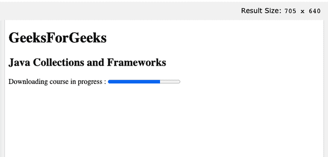
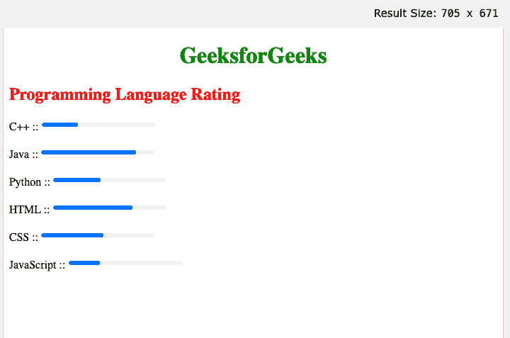

# 如何在 HTML5 中指定任务总共需要多少工时？

> 原文:[https://www . geesforgeks . org/how-to-specify-the-work-the-task-requires-in-total-html 5/](https://www.geeksforgeeks.org/how-to-specify-how-much-work-the-task-requires-in-total-in-html5/)

[<进度>](https://www.geeksforgeeks.org/html-5-progress-tag/) 标签显示一个任务完成了多少。

**属性:**

*   **最大值:**任务所需的总工作量。1 是默认值。
*   **值:**表示任务已经完成的比例。

**备注:**

要显示任务的进度，根据 JavaScript 使用 *<进度>* 标记。 *<进度>* 标签不用于反映规格(例如，磁盘空间使用情况或查询结果的相关性)。相反，使用 [*<仪表>*](https://www.geeksforgeeks.org/html5-meter-tag/) 标签来显示仪表。要获得最佳的可访问性实践，请使用 [*<标签>*](https://www.geeksforgeeks.org/html-label-tag/) 标签。

**示例 1:** 以下示例演示了如何使用<进度>标签来显示进度条。

## 超文本标记语言

```html
<!DOCTYPE html>
<html>
  <body>
    <h1>GeeksForGeeks</h1>
    <h2>Java Collections and Frameworks</h2>

    <label for="course">
      Downloading course in progress :
    </label>
    <progress id="course" value="72" max="100">
      72%
    </progress>
  </body>
</html>
```

**输出:**



进度条示例

**示例 2:** 以下示例演示了如何表示不同编程语言的评分。

## 超文本标记语言

```html
<!DOCTYPE html>
<html>
  <head>
    <style>
      h1 {
        text-align: center;
        color: green;
      }

      h2 {
        text-align: left;
        color: red;
      }
    </style>
  </head>
  <body>
    <h1>GeeksforGeeks</h1>
    <h2>Programming Language Rating</h2>

    <label for="C++">C++ ::</label>
    <progress id="C++" value="32" max="100">
      62%
    </progress>

    <br /><br />

    <label for="J">Java ::</label>
    <progress id="J" value="84" max="100">
     84%
    </progress>

    <br /><br />

    <label for="P">Python ::</label>
    <progress id="P" value="42" max="100">
     42%
    </progress>

    <br /><br />

    <label for="H">HTML ::</label>
    <progress id="H" value="70" max="100">
     70%
    </progress>

    <br /><br />

    <label for="C">CSS ::</label>
    <progress id="C" value="55" max="100">
     55%
    </progress>

    <br /><br />

    <label for="JS">JavaScript ::</label>
    <progress id="JS" value="28" max="100">
     28%
    </progress>
  </body>
</html>
```

**输出:**



<progress>标签</progress>

*<进度>* 标签也支持 HTML 全局属性。 *<进度>* 标签也支持 HTML 事件属性。