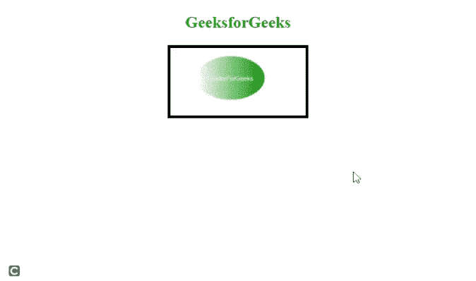

# 如何在 HTML5 中指定目标 URL 的语言？

> 原文:[https://www . geesforgeks . org/如何在 html5 中指定目标语言 URL/](https://www.geeksforgeeks.org/how-to-specify-language-of-the-target-url-in-html5/)

在本文中，我们将学习如何在 HTML5 中设置目标 URL 的语言。

使用 [**<区域>**](https://www.geeksforgeeks.org/html-area-tag/) 标记的同时，可以通过使用 [**hreflang**](https://www.geeksforgeeks.org/html-hreflang-attribute/) 属性来完成任务。该属性包含值 ***语言代码*** ，代表链接文档语言的两个字母代码。

**注意:**如果目标文档是英文的，则 *en* 作为值传递。

**语法:**

```html
<area hreflang="language_code">
```

**示例:**下面的代码也使用了 HTML [地图](https://www.geeksforgeeks.org/html-map-tag/)标签。

## 超文本标记语言

```html
<!DOCTYPE html>
<html>
  <body style="text-align: center">
    

    <map name="gfg">
      <area
        shape="ellipse"
        coords="100,49,50,30"
        href="https://www.geeksforgeeks.org/"
        hreflang="en"
      />
    </map>
  </body>
</html>
```

**输出:**

