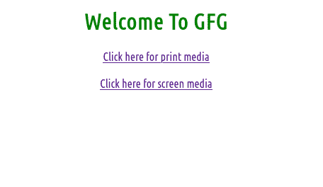

# 如何在 HTML5 中指定目标 URL 的媒体类型？

> 原文:[https://www . geesforgeks . org/how-to-specify-media-type-of-target-URL-in-html 5/](https://www.geeksforgeeks.org/how-to-specify-media-type-of-the-target-url-in-html5/)

您可以使用 HTML 的 [**媒体属性**](https://www.geeksforgeeks.org/how-to-specify-what-media-device-the-target-url-is-optimized-for/) 在 HTML5 中轻松指定目标 URL 的媒体类型。该属性用于指定目标网址是为特殊设备(如 iPhone、安卓等)、语音或打印媒体、投影仪、电视等设计的。

**语法:**

```html
<a href="" media="screen" target=”_blank”> Click here</a>
```

**注意:***媒体*属性只能在指定链接文档时使用 *href* 属性。*媒体*属性用于指定链接文档将如何以及在哪些设备中出现并兼容。

**各种设备值:**

*   **all :** 最适合所有媒体类型设备。
*   **屏幕:**用于电脑屏幕、智能手机等。
*   **电视:**用于电视类设备(低分辨率，或者滚动能力有限的设备)。
*   **打印**:用于打印预览模式/打印页面模式。

**示例:**

## 超文本标记语言

```html
<!DOCTYPE html>
<html>

<head>
    <style>
        h1 {
            color: green;
        }
    </style>
</head>

<body>
    <center>
        <h1>Welcome To GFG</h1>
        <a href="https://ide.geeksforgeeks.org/" 
            media="print" target="_blank">
            Click here for print media
        </a>
        <br /><br />
        <a href="https://ide.geeksforgeeks.org/" 
            media="tv" target="_blank">
            Click here for screen media
        </a>
    </center>
</body>

</html>
```

**输出:**

