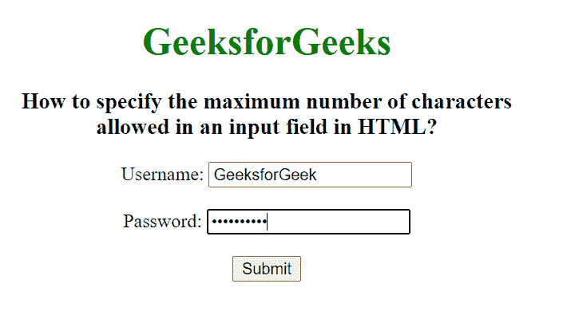
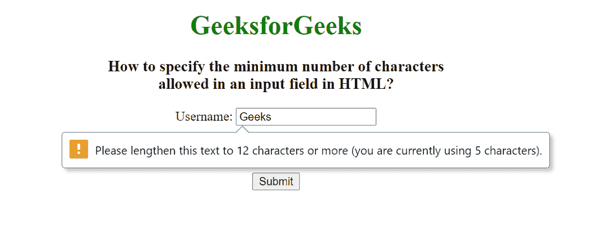

# 如何在 HTML 中指定输入字段允许的最小&最大字符数？

> 原文:[https://www . geesforgeks . org/如何指定 html 中输入字段允许的最小-最大字符数/](https://www.geeksforgeeks.org/how-to-specify-minimum-maximum-number-of-characters-allowed-in-an-input-field-in-html/)

给定一个输入字段，任务是设置 HTML 中输入字段允许的最小/最大字符数。

*   要设置输入字段中的最大字符限制，我们使用<input> maxlength 属性。该属性用于指定进入<input>元素的最大字符数。
*   要设置输入字段中的最小字符限制，我们使用<input>最小长度属性。该属性用于指定进入<input>元素的最小字符数。

**语法:**

```html
<input maxlength="number1">
<input minlength="number2"> 
```

**属性值:**

*   **数字 1:** 包含允许<输入>元素中最大字符数的单值数字。它的默认值是 524288。
*   **数字 2:** 输入字段中所需的最小字符数。

**例 1:** 设置输入字段允许的最大字符数限制。

## 超文本标记语言

```html
<!DOCTYPE html>
<html>

<head>
    <style>
        body {
            text-align: center;
        }

        h1 {
            color: green;
        }
    </style>
</head>

<body>
    <h1>GeeksforGeeks</h1>
    <h3>
        How to specify the maximum number
        of characters <br>allowed in an
        input field in HTML?
    </h3>
    <form action="#">
        Username:
        <input type="text" name="usrname" 
            maxlength="12"><br><br>

        Password:
        <input type="password" name="password"
            maxlength="10"><br><br>

        <input type="submit" value="Submit">
    </form>
</body>

</html>
```

**输出:**



**例 2:** 设置输入字段允许的最小字符数限制。

## 超文本标记语言

```html
<!DOCTYPE html>
<html>

<head>
    <style>
        body {
            text-align: center;
        }

        h1 {
            color: green;
        }
    </style>
</head>

<body>
    <h1>GeeksforGeeks</h1>
    <h3>
        How to specify the minimum number
        of characters <br>allowed in an
        input field in HTML?
    </h3>
    <form action="#">
        Username:
        <input type="text" name="usrname" 
            minlength="12"><br><br>

        Password:
        <input type="password" name="password" 
            minlength="10"><br><br>

        <input type="submit" value="Submit">
    </form>
</body>

</html>
```

**输出:**

