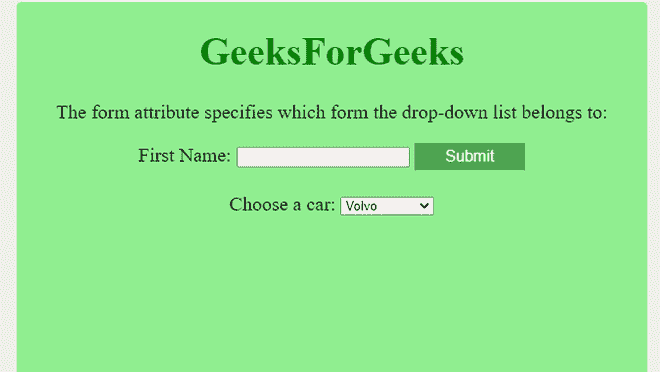

# 如何在 HTML 中指定选择字段所属的多个表单？

> 原文:[https://www . geesforgeks . org/如何指定多个表单-选择字段-属于 html/](https://www.geeksforgeeks.org/how-to-specify-multiple-forms-the-select-field-belongs-to-in-html/)

任务是指定选择字段所属的多个表单。简单地说，我们必须找出特定选择属于哪种形式。您可以通过使用表单属性来完成此任务。

*   **选择元素–**用于在 HTML 中创建下拉列表。
*   **表单元素–**用于创建用户输入的表单。
*   **表单属性–**该属性将告诉用户它属于哪个表单选择元素。

**进场–**

*   首先，用表单元素中的 select 元素创建 HTML 页面。
*   在表单外创建一个选择元素，并借助*表单*属性指定它属于哪个表单。

**示例 1–**

## 超文本标记语言

```html
<!DOCTYPE html>
<html>

<head>
    <style>
        body {
            text-align: center;
            font-size: 20px;
            background-color: lightgreen;
        }

        button {
            background-color: #4CAF50;
            border: none;
            color: white;
            padding: 5px 32px;
            text-align: center;
            text-decoration: none;
            display: inline-block;
            font-size: 16px;
        }
    </style>
</head>

<body>
    <h1 style="color:green">
        GeeksForGeeks
    </h1>

    <p>
        The form attribute specifies which 
        form the drop-down list belongs to:
    </p>

    <form id="carform">
        <label for="fname">First Name:</label>
        <input type="text" id="fname" name="fname">
        <button>Submit</button>
    </form>
    <br>

    <label for="cars">Choose a car:</label>
    <select id="cars" name="carlist" form="carform">
        <option value="volvo">Volvo</option>
        <option value="maruti">Maruti</option>
        <option value="Rolls-Royce">Rolls-Royce</option>
        <option value="audi">Audi</option>
    </select>
</body>

</html>
```

**输出–**



**解释–**在上面的例子中，我们创建了没有下拉菜单的表单，但是在创建了带有 select 元素的下拉菜单之后，我们在表单属性的帮助下将其分配给了表单的一部分。

**示例 2–**

## 超文本标记语言

```html
<!DOCTYPE html>
<html>

<head>
    <style>
        body {
            text-align: center;
            font-size: 20px;
        }

        button {
            background-color: #4CAF50;
            border: none;
            color: white;
            padding: 5px 32px;
            text-align: center;
            text-decoration: none;
            display: inline-block;
            font-size: 16px;
        }
    </style>
</head>

<body>
    <h1 style="color:green">
        GeeksForGeeks
    </h1>

    <p>
        The form attribute specifies which
        form the drop-down list belongs to:
    </p>

    <form id="countryName">
        <label for="fname">First Name:</label>
        <input type="text" id="fname" name="fname">
        <button>Submit</button>
    </form>
    <br>

    <label for="country">Choose a country:</label>
    <select id="country" name="carlist" form="countryName">
        <option value="India">India</option>
        <option value="US">US</option>
        <option value="Germany">Germany</option>
        <option value="Australia">Australia</option>
    </select>
</body>

</html>
```

**输出–**

