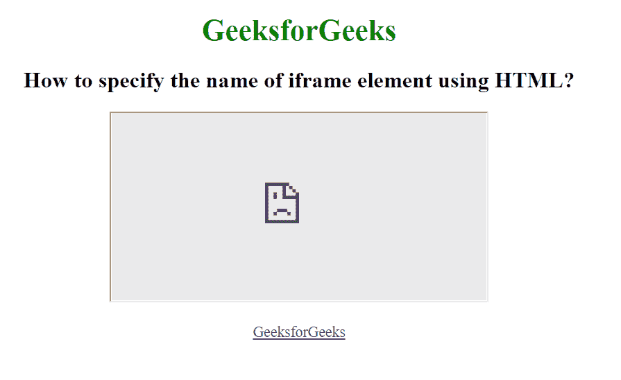

# 如何用 HTML 指定 iframe 元素的名称？

> 原文:[https://www . geesforgeks . org/如何使用 html 指定 iframe 元素的名称/](https://www.geeksforgeeks.org/how-to-specify-name-of-an-iframe-element-using-html/)

HTML 中的 iframe 代表内嵌框架。“iframe”标签在文档中定义了一个矩形区域，浏览器可以在其中显示单独的文档，包括滚动条和边框。内联框架用于在当前的 HTML 文档中嵌入另一个文档。

HTML iframe 名称属性用于指定对<iframe>元素的引用。name 属性也用作 JavaScript 中元素的引用。</iframe>

**语法:**

```html
<iframe name="name">

```

**示例:**

## 超文本标记语言

```html
<!DOCTYPE html>
<html>

<body>
    <center>
        <h1 style="color:green">
            GeeksforGeeks
        </h1>

        <h2>
            How to specify the name of
            iframe element using HTML?
        </h2>

        <iframe src="" height="200" 
                width="400" name="myGeeks">
        </iframe>
        <br><br>
        <a href="https://www.geeksforgeeks.org/" 
               target="myGeeks">
            GeeksforGeeks
        </a>
    </center>
</body>

</html>
```

**输出:**



**支持的浏览器:**

*   谷歌 Chrome
*   微软公司出品的 web 浏览器
*   火狐浏览器
*   苹果 Safari
*   歌剧