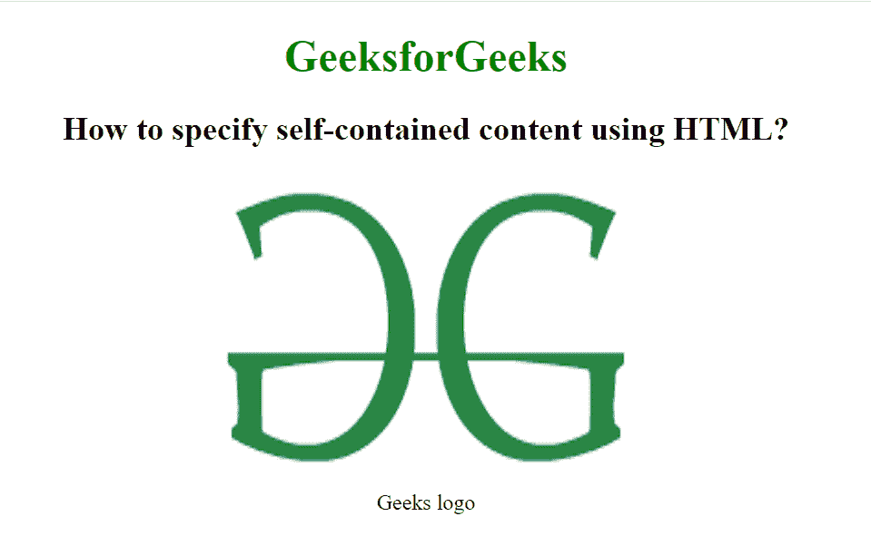

# 如何用 HTML 指定自成一体的内容？

> 原文:[https://www . geesforgeks . org/how-to-specify-self-content-use-html/](https://www.geeksforgeeks.org/how-to-specify-self-contained-content-using-html/)

HTML 中的

<figure>标签用于添加独立的内容，如文档中的插图、图表、照片或代码列表。它与主流程相关，但它可以在文档的任何位置使用，并且图形与文档的流程一致，如果删除它，则不应影响文档的流程。这个标签在 HTML5 中是新的。</figure>

**语法:**

```html
<figure> Image content... </figure>
```

**属性:**主要包含以下两个属性:

*   **img src:** 用于在文档中添加图像源。
*   **figcaption:** 用于设置图片的标题。

**示例:**

## 超文本标记语言

```html
<!DOCTYPE html>
<html>

<head>
    <title>
        How to specify self-contained
        content using HTML?
    </title>

    <style>
        body {
            text-align: center;
        }

        h1 {
            color: green;
        }
    </style>
</head>

<body>
    <h1>GeeksforGeeks</h1>

    <h2>
        How to specify self-contained
        content using HTML?
    </h2>

    <figure>
        

        <figcaption>Geeks logo</figcaption>
    </figure>
</body>

</html>
```

**输出:**



**支持的浏览器:**

*   谷歌 Chrome 6.0
*   Edge 9.0
*   Firefox 4.0
*   Safari 5.0
*   歌剧 11.1