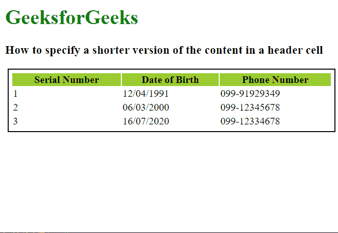

# 如何在 HTML5 中指定标题单元格中内容的较短版本？

> 原文:[https://www . geeksforgeeks . org/如何指定较短版本的标题中的内容-html5 中的单元格/](https://www.geeksforgeeks.org/how-to-specify-shorter-version-of-the-content-in-a-header-cell-in-html5/)

在本文中，我们将学习如何在标题单元格中指定内容的较短版本。这对屏幕阅读器用户很有帮助，因为他们不需要读出更大的标题，也不需要理解已知的缩写。第[*<>*](https://www.geeksforgeeks.org/html-th-tag/)标签用于指定一个 [*<表格>*](https://www.geeksforgeeks.org/html-html-tag/) 元素的标题，标题的内容定义在标题标签之间。

**方法:**[***缩写***](https://www.geeksforgeeks.org/html-abbr-tag/) 属性的 *<第>* 标签用于指定标题内容的缩写。这对普通的网络浏览器没有影响。然而，屏幕阅读器将能够读取信息。

**语法:**

```html
<th abbr="text"> 
```

以下示例说明了**缩写**属性，以指定标题单元格内容的较短版本。

**示例:**

## 超文本标记语言

```html
<html>
<style>
 table {
    border: 2px solid;
    padding: 4px;
    margin: 4px;
    width: 100%;
  }

  th {
    background-color: yellowgreen;
  }
</style>

<body>
  <h1 style="color: green;">
    GeeksforGeeks
  </h1>
  <h3>
    How to specify a shorter version of
    the content in a header cell
  </h3>

  <table>
    <tr>

      <!-- Use the abbr attribute to specify
      the shorter version -->
      <th abbr="S. No">Serial Number</th>
      <th abbr="DOB">Date of Birth</th>
      <th abbr="Ph. No.">Phone Number</th>
    </tr>
    <tr>
      <td>1</td>
      <td>12/04/1991</td>
      <td>099-91929349</td>
    </tr>
    <tr>
      <td>2</td>
      <td>06/03/2000</td>
      <td>099-12345678</td>
    </tr>
    <tr>
      <td>3</td>
      <td>16/07/2020</td>
      <td>099-12334678</td>
    </tr>
  </table>
</body>
</html>
```

**输出:**缩写不会显示，因为普通网络浏览器不会显示它们。

