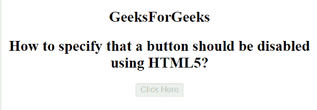

# 如何使用 HTML5 指定某个按钮应该禁用？

> 原文:[https://www . geeksforgeeks . org/如何使用-html5/指定应该禁用的按钮/](https://www.geeksforgeeks.org/how-to-specify-that-a-button-should-be-disabled-using-html5/)

在本文中，我们通过在 **<按钮>** 元素中使用**禁用**属性来指定禁用的按钮。禁用的按钮不可点击且不可用。它是一个布尔属性。

**语法:**

```html
<button disabled></button>
```

**示例:**

```html
<!DOCTYPE html> 
<html> 
    <head> 
        <title>
            How to specify that a button 
should be disabled using HTML5?

              </title> 
    </head> 

    <body> 
      <center>
        <p>
            <h2>
                GeeksForGeeks
        </h2>
        </p> 
        <h2>
            How to specify that a button 
should be disabled using HTML5?
        </h2>

        <!-- button tag starts from here -->
        <button type = "button" onclick = 
            "alert('Welcome to GeeksforGeeks')" Disabled> 
            Click Here 
        </button> 
        <!-- button tag ends here -->

    </body> 
</html>                     
```

**输出:**


**支持的浏览器如下:**

*   谷歌 Chrome
*   微软公司出品的 web 浏览器
*   火狐浏览器
*   歌剧
*   旅行队