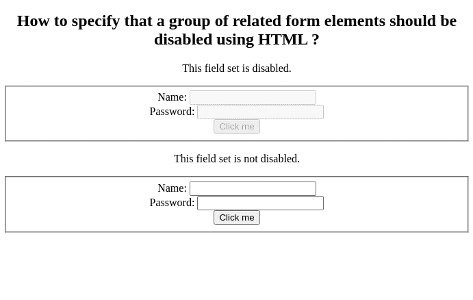

# 如何使用 HTML 指定禁用一组相关表单元素？

> 原文:[https://www . geeksforgeeks . org/如何使用-html/](https://www.geeksforgeeks.org/how-to-specify-that-a-group-of-related-form-elements-should-be-disabled-using-html/) 指定应该禁用一组相关表单元素

在本文中，我们将学习如何使用 HTML 指定禁用一组相关的表单元素。当禁用属性存在时，它指定输入字段被禁用。我们不能在*禁用的*输入字段中写入任何内容。

**方法:**我们将使用 **[禁用属性](https://www.geeksforgeeks.org/html-disabled-attribute/)** 和<字段集>元素。HTML 中<字段集>元素的**禁用**属性用于指定相关表单元素组被禁用。禁用的字段集不可选择且不可用。它是一个布尔属性。

**语法:**

```html
<fieldset disabled>content</fieldset>
```

**示例:**

## 超文本标记语言

```html
<html>
<body style="text-align:center">
    <h2>How to specify that a group of related
      form elements should be disabled using HTML ?
    </h2>
    <p>This field set is disabled.</p>
    <!-- A disabled fieldset -->
    <fieldset disabled>
        Name: <input type="text"><br>
        Password: <input type="text"><br>
        <input type="submit" value="Click me">

    </fieldset>
    <p>This field set is not disabled.</p>
    <!-- Not a disabled fieldset -->
    <fieldset>
        Name: <input type="text"><br>
        Password: <input type="text"><br>
        <input type="submit" value="Click me">
    </fieldset>
</body>
</html>
```

**输出:**

