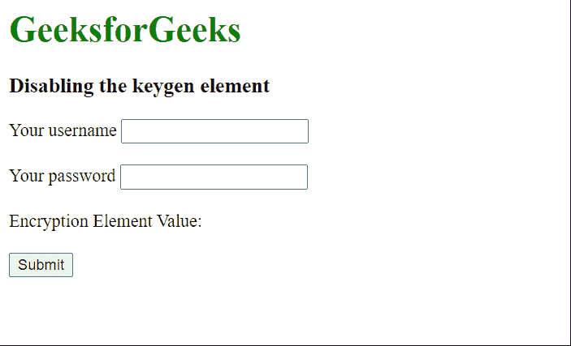

# 如何在 HTML 中指定某个 keygen 元素应该禁用？

> 原文:[https://www . geesforgeks . org/如何在 html 中指定-a-key gen-element-应该禁用/](https://www.geeksforgeeks.org/how-to-specify-that-a-keygen-element-should-be-disabled-in-html/)

HTML 中的<keygen>元素有助于加密密钥的生成，这样数据就可以在服务器和客户端之间安全地传输。在系统需求较少的用户情况下，这种加密可能会影响用户体验，降低网站性能。这可能会导致用户界面出现问题，并可能导致网站使用混乱。因此，可能需要在不必要的情况下禁用它。

这可以通过使用<键根>元素的**禁用**属性来实现。这将阻止元素生成它应该生成的键值对。

#### 语法:

```html
<keygen name="security" disabled>
```

**示例:**在以下示例中，<键根>元素使用**禁用的**属性禁用。

## 超文本标记语言

```html
<html>
<body>
  <h1 style="color: green;">
    GeeksforGeeks
  </h1>
  <h3>Disabling the keygen element</h3>
  <!-- Form for enclosing all the
  available inputs -->
  <form method="post" action="/">

    <label for="name">Your username</label>
    <input type="text" name="name">
    <br><br>
    <label for="name">Your password</label>
    <input type="password" name="pass">
    <br><br>

    <!-- Disable the <keygen> element using
    the disabled attribute -->
    Encryption Element Value:
    <keygen name="security" disabled>
    <br><br>
    <input type="submit">
  </form>
</body>
</html>
```

**输出:**

