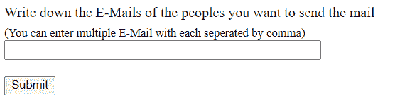
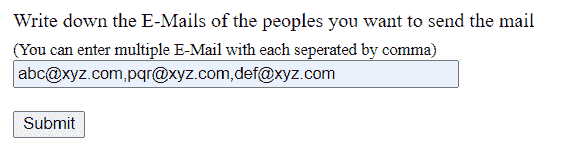
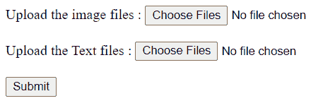
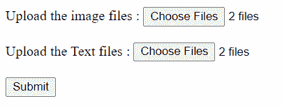
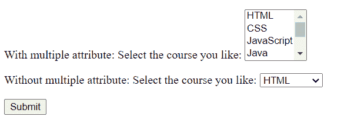

# 如何在 HTML5 中指定用户可以在一个输入元素中输入多个值？

> 原文:[https://www . geesforgeks . org/如何指定用户可以在 html5 中的输入元素中输入多个值/](https://www.geeksforgeeks.org/how-to-specify-that-a-user-can-enter-more-than-one-value-in-an-input-element-in-html5/)

**多个**属性用于指定用户是否可以在一个输入元素中输入多个值。它是一个布尔属性。当设置为 true 时，输入元素可以接受多个值。多个属性可以通过以下方式使用。

*   **用** [**<输入>标记**](https://www.geeksforgeeks.org/html-input-tag/#:~:text=The%20input%20tag%20is%20used,can%20be%20used.) 只有邮件和文件类型接受多重属性。
*   **用** [**<选择>标记**](https://www.geeksforgeeks.org/html-select-tag/) 当使用多属性时，大多数浏览器显示的是滚动列表框，而不是简单的一行下拉列表。这允许用户选择多个选项。

**示例 1:** 本示例展示了如何在输入区域输入多封电子邮件。每封电子邮件由逗号分隔。列表中的每个地址都将删除任何前导空格和尾随空格。

## 超文本标记语言

```html
<html>
<body>
    <form action=" ">

<p>
        <label>
            Write down the E-Mails of the
              peoples you want to send the mail
        </label>
        <br>
        <sub>
            (You can enter multiple E-Mail with
            each seperated by comma)
        </sub>
        <input type="email" name="email"
               id="email" multiple size="50">
      </p>

<p>
         <input type="submit" value="Submit">
      </p>

    </form>
</body>
</html>
```

**输出:**

在输入电子邮件地址之前



输入电子邮件地址后



**示例 2:** 本示例展示了如何使用<输入>标签选择多个文件。通常只允许一个文件，但是使用多个文件，用户可以选择多个文件。

## 超文本标记语言

```html
<html>
<body>
    <form action=" ">

<p>
        <label for="file">
            Upload the image files :
        </label>
        <input type="file" name="upload"
               id="upload" multiple
               accept=".jpeg,.jpg,.png">
        <br><br>
        <label for="file">
            Upload the Text files :
        </label>
        <input type="file" name="upload"
               id="upload" multiple
               accept=".txt">
      </p>

<p>
          <input type="submit" value="Submit">
      </p>

    </form>
</body>
</html>
```

**输出:**

在添加文件之前:



添加文件后:



**示例 3:** 该示例显示了如何在<选择>输入中选择多个选项。用户可以使用 CTRL 键从选项列表中选择零个或多个选项，或者使用开发人员给出的解决方案。

## 超文本标记语言

```html
<html>
<body>
  <form action=" ">

<p>
      With multiple attribute:   
      <label for="course">
        Select the course you like:
      </label>
      <select multiple name="course"
              id="course">
        <option>HTML</option>
        <option>CSS</option>
        <option>JavaScript</option>
        <option>Java</option>
        <option>C++</option>
        <option>C</option>
        <option>Python</option>
      </select>
    </p>

<p>
      Without multiple attribute:
      <label for="course">
        Select the course you like:
      </label>
      <select name="course" id="course">
        <option>HTML</option>
        <option>CSS</option>
        <option>JavaScript</option>
        <option>Java</option>
        <option>C++</option>
        <option>C</option>
        <option>Python</option>
      </select>
    </p>

<p>
      <input type="submit" value="Submit">
    </p>

  </form>
</body>
</html>
```

**输出:**

