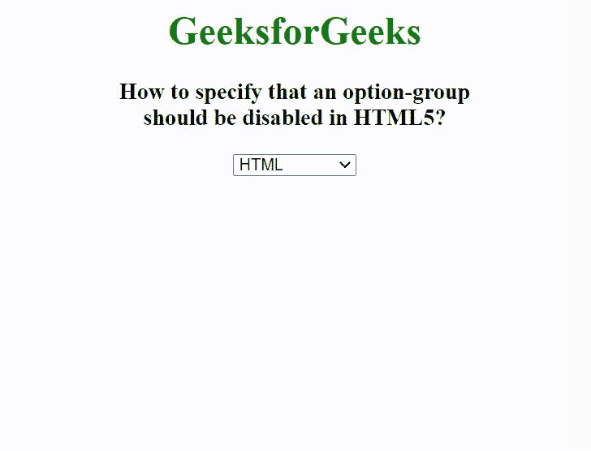

# 如何在 HTML5 中指定禁用选项组？

> 原文:[https://www . geesforgeks . org/如何在 html5 中指定一个选项组应该被禁用/](https://www.geeksforgeeks.org/how-to-specify-that-an-option-group-should-be-disabled-in-html5/)

我们将使用[*<opt group>*](https://www.geeksforgeeks.org/html-optgroup-tag/)和 [*<选项>*](https://www.geeksforgeeks.org/html-option-tag/) 标签创建选项-组列表，并使用 *disabled* 属性搭配 *< optgroup >* 创建禁用的选项-组列表。 *< optgroup >* 标签用于在下拉列表中创建一组相同类别的选项。当存在一长串项目时，需要 *< optgroup >* 标签。HTML 中的 *<选项>* 标签用于从下拉菜单中选择一个选项。

**语法:**

```html
<optgroup label="">
    <option label="">  </option>
</optgroup>
```

**示例:**

## 超文本标记语言

```html
<!DOCTYPE html>
<html>

<head>
    <title>
        How to specify that an option-group
        should be disabled in HTML5?
    </title>
</head>

<body style="text-align: center;">
    <h1 style="color: green;">
        GeeksforGeeks
    </h1>

    <h3>
        How to specify that an option-group<br>
        should be disabled in HTML5?
    </h3>

    <select>
        <optgroup label="Computer Programming" disabled>
            <option value="c">C</option>
            <option value="cpp">C++</option>
            <option value="java">Java</option>
            <option value="python">Python</option>
        </optgroup>

        <optgroup label="Web Technology">
            <option value="html">HTML</option>
            <option value="css">CSS</option>
            <option value="js">JavaScript</option>
            <option value="jquery">jQuery</option>
        </optgroup>
    </select>
</body>

</html>
```

**输出:**

