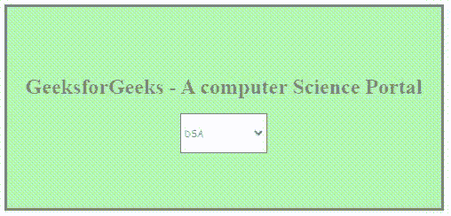
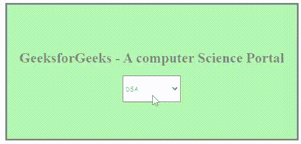

# 如何在 HTML5 中指定某个选项应该禁用？

> 原文:[https://www . geeksforgeeks . org/如何在 html5 中指定应该禁用的选项/](https://www.geeksforgeeks.org/how-to-specify-that-an-option-should-be-disabled-in-html5/)

[<选择>标签](https://www.geeksforgeeks.org/html-select-tag/#:~:text=It%20specifies%20that%20the%20user,the%20element%20in%20a%20JavaScript.)用于在 HTML 文档中创建下拉列表。一般来说，当要从用户那里收集一些数据时，会在表单中使用它。默认情况下，可以从使用<选择>元素创建的下拉列表中选择或选择所有值或选项。但是，有时我们可能希望用户从一些可能的选项中进行选择，前提是默认情况下禁用其他选项。

**方法 1:** 这可以使用禁用的属性来完成。指定后，选项变得不可用且不可点击。下面的代码演示了此方法。

## 超文本标记语言

```html
<!DOCTYPE html>
<html>
  <head>
    <style>
      #container {
        margin: 0 auto;
        height: 300px;
        width: 650px;
        border: 5px solid black;
        background-color: rgb(104, 241, 104);
        opacity: 0.5;
        display: flex;
        flex-direction: column;
        justify-content: center;
        align-items: center;
      }
      .tagging {
        height: 60px;
        width: 130px;
        border: 2px solid black;
        font-family: cursive;
      }
    </style>
  </head>
  <body>
    <div id="container">
      <h1 id="heading1">
        GeeksforGeeks - A computer Science Portal
      </h1>
      <select class="tagging">
        <option value="tag" disabled>Choose course</option>
        <option value="Option A">DSA</option>
        <option value="Option B">Python</option>
        <option value="Option C">Java</option>
        <option value="Option D">Others</option>
      </select>
    </div>
  </body>
</html>
```

**输出**在本例中，“选择课程”已使用“禁用”属性禁用。虽然下拉列表中有五个选项，但我们阻止用户选择第一个选项。



**方法 2:** 使用 HTML5 中的 [< optgroup >](https://www.geeksforgeeks.org/html-optgroup-tag/) 标签演示了以下示例。<选项组>标签用于在 [<选择>](https://www.geeksforgeeks.org/html-select-tag/) 元素(下拉列表)中对相关选项进行分组。

## 超文本标记语言

```html
<!DOCTYPE html>
<html>
  <head>
    <style>
      #container {
        margin: 0 auto;
        height: 300px;
        width: 650px;
        border: 5px solid black;
        background-color: rgb(104, 241, 104);
        opacity: 0.5;
        display: flex;
        flex-direction: column;
        justify-content: center;
        align-items: center;
      }

      .tagging {
        height: 60px;
        width: 130px;
        border: 2px solid black;
        font-family: cursive;
      }
    </style>
  </head>
  <body>
    <div id="container">
      <h1 id="heading1">
          GeeksforGeeks - A computer Science Portal
      </h1>
      <select class="tagging">
        <optgroup label="Choose Course">
          <option value="Option A">DSA</option>
          <option value="Option B">Python</option>
          <option value="Option C">Java</option>
          <option value="Option D">Others</option>
        </optgroup>
      </select>
    </div>
  </body>
</html>
```

**输出:**在本例中，<选项组>标签用于将所有四个选项组合在一起，从而防止用户选择“选择课程”选项。

