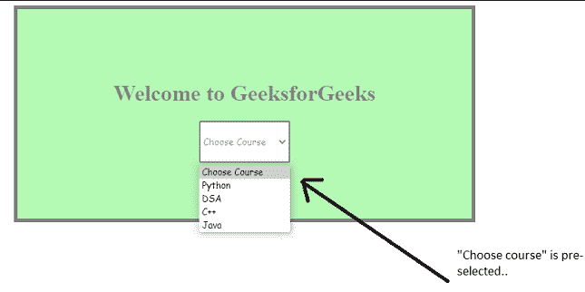
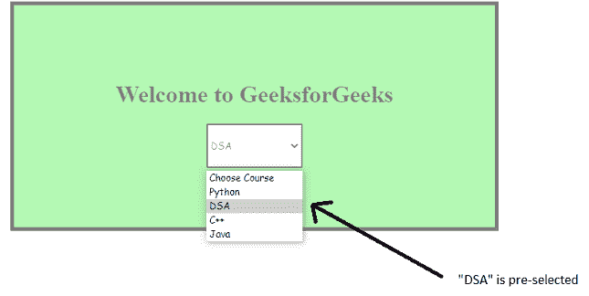

# 如何指定在 HTML5 中加载页面时要预选一个选项？

> 原文:[https://www . geeksforgeeks . org/如何在页面加载 html5/](https://www.geeksforgeeks.org/how-to-specify-that-an-option-should-be-pre-selected-when-the-page-loads-in-html5/) 时预先选择指定选项

[< **选项** >](https://www.geeksforgeeks.org/html-option-tag/) 标签在[选择](https://www.geeksforgeeks.org/html-select-tag/)列表中定义了一个选项。<选项>标记通常与 value 属性一起使用，以指定应该将哪个值发送到服务器进行进一步处理。当使用 *<选择>* 元素创建下拉列表时，第一个选项或由 *<选项>* 标记定义的第一个选项被视为所选选项。

**示例 1:** 以下示例演示了将预先选择第一个选项。

## 超文本标记语言

```html
<!DOCTYPE html>
<html>
  <head>
    <style>
      #container {
        margin: 0 auto;
        height: 300px;
        width: 650px;
        border: 5px solid black;
        background-color: rgb(104, 241, 104);
        opacity: 0.5;
        display: flex;
        flex-direction: column;
        justify-content: center;
        align-items: center;
      }

      .courses {
        height: 60px;
        width: 130px;
        border: 2px solid black;
        font-family: cursive;
      }
    </style>
  </head>
  <body>
    <div id="container">
      <h1 id="heading1">
        Welcome to GeeksforGeeks
      </h1>
      <select class="courses">
        <option value="tag">Choose Course</option>
        <option value="Option A">Python</option>
        <option value="Option B">DSA</option>
        <option value="Option C">C++</option>
        <option value="Option C">Java</option>
      </select>
    </div>
  </body>
</html>
```

**输出:**第一个选项*“选择课程”*默认为预选。但这并不局限于此，我们还可以指定在 HTML5 中加载页面时，应该预先选择任何其他选项。这可以使用*“选定”*属性来完成。下面的示例演示了这一点。



预选的

**示例 2:** 以下示例演示了使用 [*选择的*](https://www.geeksforgeeks.org/html-selected-attribute/) 属性预选择其他选项。

## 超文本标记语言

```html
<!DOCTYPE html>
<html>
  <head>
    <title>Page Title</title>
    <style>
      #container {
        margin: 0 auto;
        height: 300px;
        width: 650px;
        border: 5px solid black;
        background-color: rgb(104, 241, 104);
        opacity: 0.5;
        display: flex;
        flex-direction: column;
        justify-content: center;
        align-items: center;
      }

      .courses {
        height: 60px;
        width: 130px;
        border: 2px solid black;
        font-family: cursive;
      }
    </style>
  </head>
  <body>
    <div id="container">
      <h1 id="heading1">
        Welcome to GeeksforGeeks
      </h1>
      <select class="courses">
        <option value="tag">Choose Course</option>
        <option value="Option A">Python</option>
        <option value="Option B" selected>DSA</option>
        <option value="Option C">C++</option>
        <option value="Option C">Java</option>
      </select>
    </div>
  </body>
</html>
```

**输出:**预选第三个选项“DSA”。这是由于使用了在“每日生活津贴”选项标签中指定的*“选定”*属性。我们可以通过在相应的 [*选项*](https://www.geeksforgeeks.org/html-option-tag/) 标签中指定*选择的*属性来预先选择任何选项。

