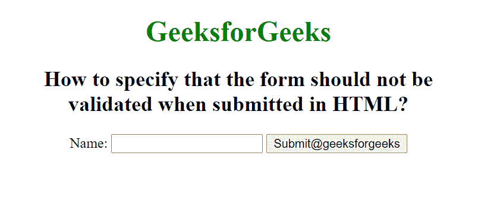

# 如何指定表单在 HTML 提交时不应该进行验证？

> 原文:[https://www . geesforgeks . org/如何指定表单在 html 中提交时不应被验证/](https://www.geeksforgeeks.org/how-to-specify-that-the-form-should-not-be-validated-when-submitted-in-html/)

HTML 中的

<form>标签用于创建表单供用户输入。表单标签中使用了许多元素。例如:<input>、<textarea>、<button>、<select>、<option>、</option><optgroup>、<fieldset>、<label>。</label></fieldset></optgroup></select></button></textarea></form>

HTML form novalidate 属性用于指定提交表单时不应验证表单数据。它是一个布尔属性。

**语法:**

```html
<form novalidate>
```

**示例:**此示例说明了 novalidate 属性在表单元素中的使用。

## 超文本标记语言

```html
<!DOCTYPE html>
<html>

<head>
    <title>
        How to specify that the form
        should not be validated when
        submitted in HTML?
    </title>
</head>

<body style="text-align:center;">
    <h1 style="color: green;">
        GeeksforGeeks
    </h1>

    <h2>
        How to specify that the form
        should not be <br>validated when
        submitted in HTML?
    </h2>

    <form action="#" method="get" 
        target="_self" novalidate>
        Name:
        <input type="text">
        <input type="submit" id="Geeks" 
            name="myGeeks" 
            value="Submit@geeksforgeeks" 
            formTarget="_blank">
    </form>
</body>

</html>
```

**输出:**



**支持的浏览器:**

*   谷歌 Chrome 10.0
*   Internet Explorer 10.0
*   Firefox 4.0
*   歌剧 10.6