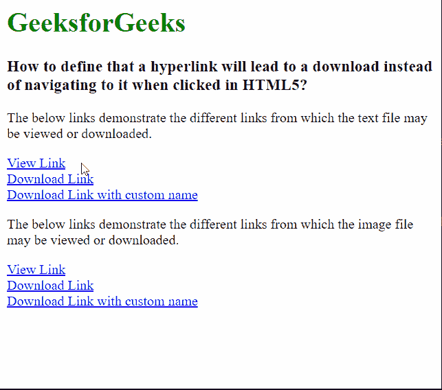

# 如何在 HTML5 中指定点击下载目标？

> 原文:[https://www . geesforgeks . org/如何通过点击 html5 指定下载目标/](https://www.geeksforgeeks.org/how-to-specify-that-the-target-will-be-downloaded-by-on-click-in-html5/)

在本文中，我们将学习如何定义超链接将导致下载，而不是在 HTML5 中单击时导航到它。这可以用于点击链接时需要下载内容的情况，如文本文件或图像托管服务。

**进场:**

**语法:**

```html
<a href="file_to_download.jpg" download="filename">
```

以下示例说明了**下载**属性，以指定要下载的目标。

**示例:**

## 超文本标记语言

```html
<html>

<body>
  <h1 style="color: green;">
    GeeksforGeeks
  </h1>

  <h3>
    How to define that a hyperlink will
    lead to a download instead of navigating
    to it when clicked in HTML5?
  </h3>

  <p>
    The below links demonstrate the different
    links from which the text file may be 
    viewed or downloaded.
  </p>

  <a href="example.txt">
    View Link
  </a><br>

  <a href="example.txt" download>
    Download Link
  </a><br>

  <a href="example.txt" download="geeks">
    Download Link with custom name
  </a>

  <p>The below links demonstrate the different
    links from which the image file may be 
    viewed or downloaded.
  </p>

  <a href="logo.png">
    View Link
  </a><br>

  <a href="logo.png" download>
    Download Link
  </a><br>

  <a href="logo.png" 
     download="gfglogo">
    Download Link with custom name
  </a>
</body>

</html>
```

**输出:**

