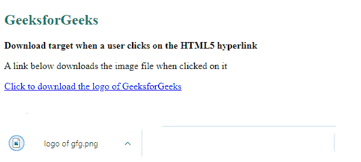

# 如何指定用户点击 HTML5 中的超链接时会下载目标？

> 原文:[https://www . geesforgeks . org/如何指定当用户点击 html5 中的超链接时将下载目标/](https://www.geeksforgeeks.org/how-to-specify-that-the-target-will-be-downloaded-when-a-user-clicks-on-the-hyperlink-in-html5/)

在本文中，我们将学习在用户打开链接时指定目标，这将进一步下载图像或任何其他文件。当用户点击超链接需要直接下载文件时，使用该链接。

**进场:**

为了做到这一点，我们必须使用一个名为 [**的属性来下载**](https://www.geeksforgeeks.org/html-a-download-attribute/) ，该属性用在 [<的一个>](https://www.geeksforgeeks.org/html-a-tag/#:~:text=The%20tag%20(anchor,the%20webpage%20to%20other%20webpages.) 标签中。用于用户点击超链接时下载元素，仅在设置 [href](https://www.geeksforgeeks.org/html-a-href-attribute/) 属性时使用。我们还可以为它提供一个值，它将为下载的文件命名。

**语法:**

```html
<a href = "file" download = "file name">
```

**例 1:**

## 超文本标记语言

```html
<!DOCTYPE html>
<html lang="en">
<!--body tag starts from here-->
<body>
    <h2 style="color:#0F9D58;">GeeksforGeeks</h2>

    <b>
     Download target when a user clicks 
     on the HTML5 hyperlink
    </b>
    <br/>
    <p>
     A link below downloads the image 
     file when clicked on it
    </p>

    <a href="gfg1.png" download="logo of gfg">
     Click to download the logo of GeeksforGeeks
    </a>
</body>
</html>
```

**输出:**我们可以看到，我们在下载属性中给出的值显示为下载文件的名称。



下载的文件

**例 2:**

```html
<!DOCTYPE html>
<html>
  <body>
    <p>Click on image to download</p>

    <a href=
"https://media.geeksforgeeks.org/wp-content/uploads/20190221234751/geeksforgeeks-logo1.png"
      download>
      
    </a>
  </body>
</html>
```

**输出:**
