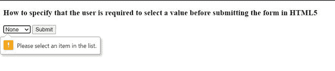
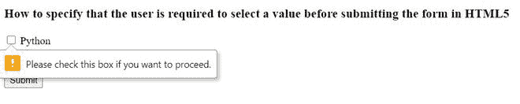

# 如何指定在 HTML5 中提交表单前要求用户选择一个值？

> 原文:[https://www . geesforgeks . org/如何指定用户在提交 html5 表单之前必须选择一个值/](https://www.geeksforgeeks.org/how-to-specify-that-the-user-is-required-to-select-a-value-before-submitting-the-form-in-html5/)

本文的目的是指定要求用户在 HTML5 中提交表单之前选择一个值。这将迫使用户在提交表单之前输入一个值。

**[<选择>所需的](https://www.geeksforgeeks.org/html-select-required-attribute/)** 属性可用于此目的。这是一个布尔属性，表示在提交表单之前必须填写输入字段。所需属性支持文本、网址、电话、电子邮件、密码、日期选择器、号码、复选框、广播和文件。

**语法:**

```html
<select name="" required>
```

下面的示例将演示这种方法:

**例 1:**

## 超文本标记语言

```html
<!DOCTYPE html>
<html>
  <body>
    <form method="post" 
          action="/">
      <h3>
        How to specify that the user is
        required to select a value before
        submitting the form in HTML5
      </h3>

      <select name="Language" required>
        <option value="">
          None
        </option>
        <option value="python">
          Python
        </option>
        <option value="cpp">
          Cpp
        </option>
        <option value="java">
          Java
        </option>
      </select>
      <input type="submit" />
    </form>
  </body>
</html>
```

**输出:**如我们所见，我们需要在提交表单之前选择列表中的项目。



**例 2:**

## 超文本标记语言

```html
<!DOCTYPE html>
<html>
  <body>
    <form method="post" action="/">
      <h3>
        How to specify that the user is required
        to select a value before
        submitting the form in HTML5
      </h3>

      <input type="checkbox" id="python"
             name="python" value="language"
             required/>
      <label for="vehicle1"> Python</label>
      <br />
      <input type="checkbox" id="cpp" name="cpp"
             value="language" required/>
      <label for="vehicle2"> Cpp</label>
      <br />
      <input type="checkbox" id="java" name="java"
             value="language" required/>
      <label for="vehicle3"> Java</label>
      <br />
      <input type="submit" />
    </form>
  </body>
</html>
```

**输出:**如我们所见，我们需要在提交表单之前选中复选框。



复选框元素