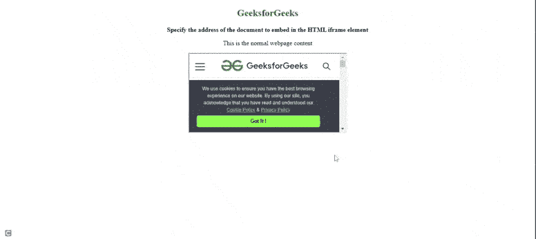
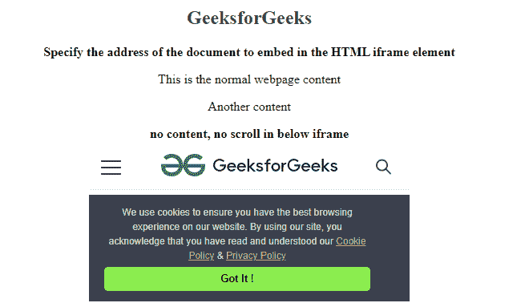

# 如何在 HTML5 中指定嵌入 iframe 元素的文档地址？

> 原文:[https://www . geeksforgeeks . org/如何指定文档地址嵌入 iframe-in-element-in-html 5/](https://www.geeksforgeeks.org/how-to-specify-the-address-of-document-to-embed-in-iframe-element-in-html5/)

HTML 中的 [**iframe**](https://www.geeksforgeeks.org/html-iframes/) 代表内嵌框架。网页中的“iframe”元素有助于使用 web 浏览器在某个特定区域或区域内显示另一个网页文档。内嵌框架用于在当前 HTML 网页中嵌入另一个网页，该网页具有不同的属性，用于加载、设置高度或宽度、允许全屏模式、s [rc](https://www.geeksforgeeks.org/html-iframe-src-attribute/) 等。

**方法:**任务是定义嵌入在 **iframe** 元素中的文档地址。只需使用文档中 **iframe** 标签的 [**src**](https://www.geeksforgeeks.org/html-iframe-src-attribute/) 属性即可完成任务。该属性用于指定嵌入到< iframe >元素的文档的 URL。

**语法:**

```html
<iframe src="URL">
```

**示例:**下面的代码说明了< iframe >元素中 **src** 属性的使用。

## 超文本标记语言

```html
<!DOCTYPE html>
<html>

<head>
</head>

<body style="text-align:center;">

    <h2 style="color:green">GeeksforGeeks</h2>

    <b>Specify the address of the document to embed in the HTML iframe element</b><br/>

<p> This is the normal webpage content</p>

    <iframe src=
          "https://www.geeksforgeeks.org/php-tutorials/"
           height="200" width="400">
    </iframe>
</body>

</html>                
```

**输出:**



**示例 2:** 下面的代码使用了没有滚动条的 iframe 元素，并使用了相应的 **iframe** 属性的框架边框。属性为“*滚动=否”*和“*边框=0* ，如示例所示。

## 超文本标记语言

```html
<!DOCTYPE html>
<html>

<head>
</head>

<body style="text-align:center;">

    <h2 style="color:green">GeeksforGeeks</h2>

    <b>Specify the address of the document to embed in the HTML iframe element</b><br/>

<p> This is the normal webpage content</p>

<p>Another content</p>

    <b>no content, no scroll in below iframe</b><br/>
    <iframe src=
          "https://www.geeksforgeeks.org/php-tutorials/"
           height="200" width="400"
           scrolling="no" frameborder="0"
           name="myFrame"
           >
    </iframe>
</body>

</html>                
```

**输出:**

