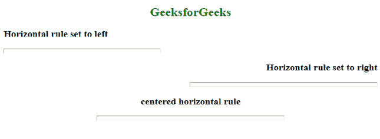

# 如何使用 HTML5 指定水平规则的对齐方式？

> 原文:[https://www . geesforgeks . org/如何使用 html5 指定水平规则的对齐方式/](https://www.geeksforgeeks.org/how-to-specify-the-alignment-of-the-horizontal-rule-using-html5/)

正如我们所知，HTML [< hr >](https://www.geeksforgeeks.org/html-hr-tag/) 标签用于在 HTML 页面中插入一个水平规则或主题分隔符，以划分或分隔文档部分。

**方法:**任务是在 HTML 中指定 *< hr >* 元素的对齐方式。这可以通过使用 HTML 文档中 *< hr >* 标签的 **[对齐属性](https://www.geeksforgeeks.org/html-hr-align-attribute/)** 来完成。用于将水平线设置为*左侧、右侧*和*中心。*

**语法:**

```html
<hr align="left | center | right">
```

**示例:**下面的代码用于设置< hr >标签的对齐。

## 超文本标记语言

```html
<!DOCTYPE html>
<html>

<head>
    <style>
        h2
        {
            text-align:center;
        }
        h3
        {
            font-weight:bold;
        }
        .gfg 
        {
           text-align:right;
            font-weight:bold;
        }
        .gfg2
        {
            font-weight:bold;
            text-align:center;
        }
    </style>
</head>

<body>    
    <h2 style="color:green">GeeksforGeeks</h2>
    <h3>
        Horizontal rule set to left
    </h3>
    <hr width="300px;"
        size="10"
        align="left">
    <h3 class="gfg">
        Horizontal rule set to right
    </h3>
    <hr width="50%" align="right"
        size="10">
        <h3 class="gfg2">
            centered horizontal rule
        </h3>

    <hr width="50%"
        size="10"
        align="center">
</body>

</html>
```

**输出:**

